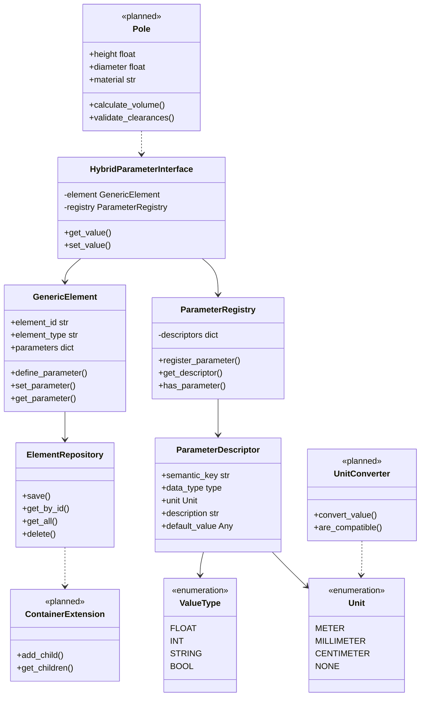

# PyM Core Architecture

> *"Regel der Modularität: Schreibe einfache Bestandteile, die durch saubere Schnittstellen verbunden werden."* - Unix Philosophy

PyM Core folgt einer strikten **5-Schichten-Architektur**, die Unix-Prinzipien der Modularität und klaren Trennung von Verantwortlichkeiten umsetzt.

## 🏗️ Architectural Overview



## 📊 Layer-by-Layer Breakdown

### 📱 Application Layer (Domain Knowledge)

**Purpose**: Domain-specific implementations that users directly interact with.

**Components**:

- `pymapp/` - Railway infrastructure domain
- `pymsys/` - Future drainage system domain

**Unix Principle**: *"Mache eine Sache und mache sie gut"*

```python
# Each domain element has a single, clear purpose
class Pole:
    """Railway pole - only pole-specific logic"""
    def calculate_foundation_depth(self) -> float: ...
    def calculate_wind_load(self) -> float: ...

class Pipe:
    """Drainage pipe - only pipe-specific logic"""
    def calculate_flow_capacity(self) -> float: ...
    def validate_gradient(self) -> bool: ...
```

**Key Characteristics**:

- Domain expertise embedded in classes
- Business logic and calculations
- User-facing APIs
- **No direct storage access** - uses Core Layer

### 🔌 Interface Layer (Access Patterns)

**Purpose**: Unified parameter access bridging different usage patterns.

**Components**:

- `HybridParameterInterface` - ENUM ↔ String parameter access
- `helper.values` - Type conversion with validation
- `UnitConverter` - Unit transformation

**Unix Principle**: *"Schnittstellen von Verarbeitungslogik trennen"*

```python
# Same data, different access patterns
interface = HybridParameterInterface(element, registry)

# ENUM-based (semantic)
height = interface.get_value(RailwayParameters.HEIGHT, 0.0)

# String-based (generic)
height = interface.get_value("height", 0.0)

# Both work identically - interface abstracts the difference
```

**Key Characteristics**:

- Multiple access patterns for same data
- Type safety with runtime validation
- Unit conversion transparency
- **No domain knowledge** - pure interface logic

### 🎯 Core Layer (Universal Abstractions)

**Purpose**: Domain-agnostic containers and schema management.

**Components**:

- `GenericElement` - Universal parameter container
- `ParameterRegistry` - Schema definitions and mappings
- `ParameterDescriptor` - Type and validation metadata

**Unix Principle**: *"Universelle Schnittstelle"*

```python
# GenericElement works for ANY domain
railway_pole = GenericElement("pole_001", "pole")
drainage_pipe = GenericElement("pipe_001", "pipe")
building_beam = GenericElement("beam_001", "beam")

# Same interface, different domains
for element in [railway_pole, drainage_pipe, building_beam]:
    element.set_parameter("length", 5000.0)
    length = element.get_parameter("length", 0.0)
```

**Key Characteristics**:

- Domain-agnostic data structures
- Parameter definition ↔ value separation
- Schema-driven validation
- **No business logic** - pure data management

### 💾 Storage Layer (Persistence)

**Purpose**: Data persistence and extensibility without domain knowledge.

**Components**:

- `ElementRepository` - JSON-first persistence
- `ContainerExtension` - Hierarchical data structures
- Query system - Filtering and aggregation

**Unix Principle**: *"Einfache Textdateien"*

```python
# JSON-first approach - everything is inspectable
repository = ElementRepository()
repository.save(element)  # → readable JSON file

# File-based debugging
repository.save_to_file("debug_snapshot.json")
# → Can inspect with any text editor or JSON tool
```

**Key Characteristics**:

- JSON-first, database-later strategy
- Container extensions for complex data
- File-based debugging capabilities
- **No domain assumptions** - stores any GenericElement

### 🧰 Foundation Layer (Building Blocks)

**Purpose**: Basic types, utilities, and helper functions.

**Components**:

- `types.py` - ValueType, Unit enumerations
- `geometry.py` - Spatial data structures
- `helper/` - Type guards and conversion utilities

**Unix Principle**: *"Klein ist schön"*

```python
# Small, focused utilities
from pymcore.helper import as_float, as_int, is_str

# Each function does one thing well
value = as_float("123.45")  # Safe conversion
is_number = is_float("123.45")  # Type checking
```

**Key Characteristics**:

- Small, single-purpose utilities
- No dependencies on upper layers
- Comprehensive type safety
- **Foundation for everything else** - used throughout system

## 🔄 Inter-Layer Communication

### Data Flow Patterns

```python
# 1. Top-Down: Application → Storage
pole = Pole("pole_001")                    # Application Layer
pole.set_height(6.0, Unit.METER)          # → Interface Layer
# → Core Layer (GenericElement)
# → Storage Layer (Repository)

# 2. Bottom-Up: Foundation → Application
raw_value = "6.0"                          # Foundation Layer
converted = as_float(raw_value)            # → Interface Layer
element.set_parameter("height", converted) # → Core Layer
pole_height = pole.height                  # → Application Layer
```

### Dependency Rules

**Strict Downward Dependencies Only**:

- Application Layer → Interface Layer ✅
- Interface Layer → Core Layer ✅
- Core Layer → Storage Layer ✅
- Storage Layer → Foundation Layer ✅
- **No upward dependencies** ❌

**Example: Adding New Domain**

```python
# To add building domain, only touch Application Layer
class Building(GenericElement):  # Uses Core Layer
    def __init__(self, building_id: str):
        super().__init__(building_id, "building")
        # All lower layers work unchanged!
```

## 🎯 Design Principles in Action

### 1. Single Responsibility (Each Layer Has One Job)

```python
# GenericElement: Only parameter management
element.set_parameter("height", 5000.0)    # ✅ Core responsibility
element.calculate_volume()                  # ❌ Business logic

# Pole: Only domain-specific logic
pole.calculate_volume()                     # ✅ Domain responsibility
pole.save_to_database()                    # ❌ Persistence logic
```

### 2. Open/Closed Principle (Extensible via Lower Layers)

```python
# Add new element type: Only touch Application Layer
class Sleeper(RailwayElement):              # Extends via composition
    def __init__(self, sleeper_id: str):
        super().__init__(sleeper_id, "sleeper")  # Uses existing Core
```

### 3. Dependency Inversion (High-level doesn't depend on details)

```python
# Pole doesn't know about JSON, SQL, or any storage details
class Pole:
    def save(self, repository: ElementRepository):  # Abstract interface
        repository.save(self.get_core_element())   # Delegates to lower layer
```

## 🔧 Practical Implications

### Testing Strategy

```python
# Each layer tested independently
def test_core_layer():
    element = GenericElement("test", "test_type")
    element.set_parameter("height", 5000.0)
    assert element.get_parameter("height") == 5000.0

def test_application_layer():
    pole = Pole("test_pole")  # Uses real Core Layer
    pole.set_height(6.0, Unit.METER)
    assert pole.height == 6000.0  # Domain logic verified
```

### Performance Characteristics

```python
# Core Layer: O(1) parameter access
element.get_parameter("height")  # Hash table lookup

# Interface Layer: O(1) + conversion cost
interface.get_value("height", Unit.METER)  # Lookup + unit conversion

# Application Layer: O(1) + domain logic
pole.calculate_volume()  # Parameter access + mathematical calculation
```

### Error Handling Strategy

```python
# Foundation Layer: Type conversion errors
try:
    value = as_float("invalid")
except ValueConversionError:
    # Handle at foundation level

# Core Layer: Parameter definition errors
try:
    element.set_parameter("undefined_param", value)
except ParameterNotDefinedError:
    # Handle at core level

# Application Layer: Domain validation errors
try:
    pole.set_height(-1000.0)  # Negative height
except ValidationError:
    # Handle at domain level
```

## 🚀 Future Architecture Evolution

### Planned Extensions

1. **Unix Pipeline Layer** (above Application)

   ```python
   # ElementStream for Unix-style processing
   elements | filter_beams | calculate_volumes | sort_by_height
   ```

2. **Plugin Discovery Layer** (between Interface and Application)

   ```python
   # Auto-discovery of domain implementations
   registry.discover_plugins("pymcore.domains.*")
   ```

3. **Performance Layer** (between Core and Storage)

   ```python
   # Caching and optimization without changing interfaces
   cached_repository = CachedRepository(json_repository)
   ```

## 📚 Related Documentation

- **[Unix Principles](./docs/philosophy/unix-principles.md)** - Why this architecture matters
- **[GenericElement Deep-Dive](./docs/core/generic-element.md)** - Core Layer implementation
- **[Parameter System](./docs/core/parameter-system.md)** - Cross-layer parameter handling
- **[Plugin Architecture](./docs/plugins/plugin-architecture.md)** - Extensibility patterns

---

**The architecture follows Unix wisdom: simple parts, clean interfaces, maximum composability.** 🏗️⚡
