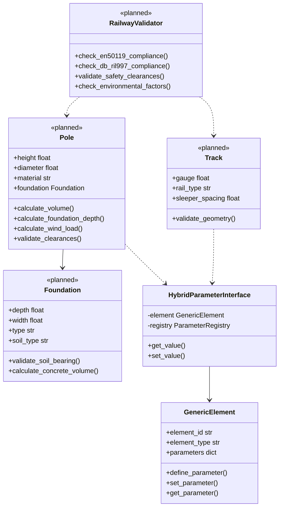

# Railway Elements - Domain-Specific Implementation

> *"Mache eine Sache und mache sie gut"* - Domain-spezifische Railway-Klassen auf universellem Core

## 🎯 Purpose

Die Railway Elements im `pymapp` Package zeigen die praktische Anwendung der PyM Core Architektur für eine spezifische Infrastruktur-Domäne. Sie demonstrieren, wie **Domain-spezifische Business Logic** auf der **universellen Core-Abstraktion** aufbaut.

## 🏗️ Design Philosophy

### Unix-Prinzip: Composition over Inheritance

```python
# ❌ Traditioneller OOP-Ansatz
class Pole(InfrastructureElement):
    def __init__(self):
        super().__init__()
        self.height = 0.0        # Feste Struktur
        self.diameter = 0.0      # Schwer erweiterbar
        self.material = "steel"  # Statisches Schema

# ✅ PyM Core Ansatz
class Pole:
    def __init__(self, element_id: str, registry: ParameterRegistry):
        self._core = GenericElement(element_id, "POLE")  # Universeller Container
        self._interface = HybridParameterInterface(self._core, "pole", registry)
        self._setup_parameters()  # Flexibles Schema

    def calculate_volume(self) -> float:
        # Business Logic auf flexibler Basis
        return math.pi * (self.diameter/2)**2 * self.height
```

### Layered Responsibility

- **Application Layer**: Domain-spezifische Berechnungen und Validierung
- **Interface Layer**: Parameter-Zugriff und Konvertierung
- **Core Layer**: Universelle Datenhaltung
- **Foundation Layer**: Type Safety und Unit Conversion

## 📊 Railway Domain Architecture



## 🔧 Railway Element Implementations

### Pole Class - Core Railway Element

**Location**: `src/pymapp/elements/pole.py` (planned)

```python
from pymcore import GenericElement, HybridParameterInterface, ParameterRegistry
from pymcore.types import Unit, ValueType
from pymapp.enums import RailwayParameters
import math
from typing import Optional

class Pole:
    """Railway pole with domain-specific calculations and validations."""

    def __init__(self, element_id: str, registry: ParameterRegistry):
        self._core = GenericElement(element_id, "POLE")
        self._registry = registry
        self._setup_parameters()
        self._interface = HybridParameterInterface(self._core, "pole", registry)

    def _setup_parameters(self):
        """Define pole-specific parameters."""
        # Physical dimensions
        self._core.define_parameter("height", ValueType.FLOAT, Unit.MILLIMETER)
        self._core.define_parameter("diameter", ValueType.FLOAT, Unit.MILLIMETER)
        self._core.define_parameter("wall_thickness", ValueType.FLOAT, Unit.MILLIMETER)

        # Material properties
        self._core.define_parameter("material", ValueType.STRING, Unit.NONE)
        self._core.define_parameter("material_density", ValueType.FLOAT, Unit.KILOGRAM)  # kg/m³

        # Foundation properties
        self._core.define_parameter("foundation_depth", ValueType.FLOAT, Unit.MILLIMETER)
        self._core.define_parameter("foundation_diameter", ValueType.FLOAT, Unit.MILLIMETER)
        self._core.define_parameter("soil_type", ValueType.STRING, Unit.NONE)

        # Electrical properties
        self._core.define_parameter("voltage_level", ValueType.FLOAT, Unit.VOLT)
        self._core.define_parameter("conductor_count", ValueType.INT, Unit.NONE)

        # Positional properties
        self._core.define_parameter("km_position", ValueType.FLOAT, Unit.METER)
        self._core.define_parameter("track_side", ValueType.STRING, Unit.NONE)  # "left", "right", "center"

    # ===========================================
    # PROPERTIES (Type-safe access via interface)
    # ===========================================

    @property
    def element_id(self) -> str:
        return self._core.element_id

    @property
    def height(self) -> float:
        """Pole height above ground in millimeters."""
        return self._interface.get_value(RailwayParameters.HEIGHT, 0.0)

    @height.setter
    def height(self, value: float):
        self._interface.set_value(RailwayParameters.HEIGHT, value)

    def set_height(self, value: float, unit: Unit = Unit.MILLIMETER):
        """Set height with automatic unit conversion."""
        self._interface.set_value(RailwayParameters.HEIGHT, value, unit)

    @property
    def diameter(self) -> float:
        """Pole diameter at base in millimeters."""
        return self._interface.get_value(RailwayParameters.DIAMETER, 0.0)

    @diameter.setter
    def diameter(self, value: float):
        self._interface.set_value(RailwayParameters.DIAMETER, value)

    @property
    def material(self) -> str:
        """Pole material specification."""
        return self._interface.get_value(RailwayParameters.MATERIAL, "steel")

    @material.setter
    def material(self, value: str):
        self._interface.set_value(RailwayParameters.MATERIAL, value)

    @property
    def foundation_depth(self) -> float:
        """Foundation depth below ground in millimeters."""
        return self._interface.get_value("foundation_depth", 0.0)

    @foundation_depth.setter
    def foundation_depth(self, value: float):
        self._interface.set_value("foundation_depth", value)

    # ===========================================
    # DOMAIN-SPECIFIC CALCULATIONS
    # ===========================================

    def calculate_volume(self) -> float:
        """Calculate pole volume in cubic millimeters."""
        radius = self.diameter / 2
        return math.pi * radius**2 * self.height

    def calculate_weight(self) -> float:
        """Calculate pole weight in kilograms."""
        volume_m3 = self.calculate_volume() / (1000**3)  # Convert mm³ to m³
        density = self._interface.get_value("material_density", 7850.0)  # kg/m³ for steel
        return volume_m3 * density

    def calculate_foundation_depth(self, wind_zone: int = 1, soil_factor: float = 1.0) -> float:
        """Calculate required foundation depth based on pole dimensions and conditions."""
        # Base calculation: 15% of pole height
        base_depth = self.height * 0.15

        # Wind zone factor (higher zones need deeper foundations)
        wind_factor = 1.0 + (wind_zone - 1) * 0.1

        # Soil factor (soft soil needs deeper foundations)
        adjusted_depth = base_depth * wind_factor * soil_factor

        # Minimum depth: 800mm
        return max(adjusted_depth, 800.0)

    def calculate_wind_load(self, wind_speed: float = 28.0) -> float:
        """Calculate wind load on pole in Newtons (EN 50119 standard)."""
        # Surface area exposed to wind
        surface_area = self.diameter * self.height / 1000000  # Convert to m²

        # Wind pressure: p = 0.5 * ρ * v²  (ρ_air ≈ 1.225 kg/m³)
        wind_pressure = 0.5 * 1.225 * wind_speed**2  # N/m²

        # Drag coefficient for cylindrical pole ≈ 1.2
        drag_coefficient = 1.2

        return wind_pressure * surface_area * drag_coefficient

    def calculate_clearance_violations(self, adjacent_elements: list) -> list:
        """Check for clearance violations with adjacent elements."""
        violations = []
        min_clearance = 2500.0  # 2.5m minimum clearance

        for element in adjacent_elements:
            distance = self._calculate_distance_to(element)
            if distance < min_clearance:
                violations.append({
                    'element': element.element_id,
                    'distance': distance,
                    'required': min_clearance,
                    'violation': min_clearance - distance
                })

        return violations

    # ===========================================
    # VALIDATION METHODS
    # ===========================================

    def validate_en50119_compliance(self) -> list:
        """Validate against EN 50119 railway standard."""
        violations = []

        # Height constraints
        if self.height < 3000:
            violations.append("Pole height below minimum 3000mm")
        if self.height > 12000:
            violations.append("Pole height exceeds maximum 12000mm")

        # Diameter constraints
        if self.diameter < 100:
            violations.append("Pole diameter below minimum 100mm")

        # Foundation depth check
        required_depth = self.calculate_foundation_depth()
        if self.foundation_depth < required_depth:
            violations.append(f"Foundation depth {self.foundation_depth}mm below required {required_depth:.0f}mm")

        return violations

    def validate_structural_integrity(self, load_factors: dict = None) -> dict:
        """Validate structural integrity under various loads."""
        if load_factors is None:
            load_factors = {
                'wind_speed': 28.0,  # m/s
                'ice_load': 0.0,     # kg/m
                'conductor_tension': 5000.0  # N
            }

        wind_load = self.calculate_wind_load(load_factors['wind_speed'])
        total_load = wind_load + load_factors['conductor_tension']

        # Simplified bending moment calculation
        bending_moment = total_load * self.height / 1000  # Nm

        # Material yield strength (simplified)
        yield_strength = 235_000_000 if self.material == "steel" else 200_000_000  # N/m²

        # Section modulus for circular cross-section
        section_modulus = (math.pi * self.diameter**3) / (32 * 1000**3)  # m³

        # Bending stress
        bending_stress = bending_moment / section_modulus  # N/m²

        safety_factor = yield_strength / bending_stress if bending_stress > 0 else float('inf')

        return {
            'wind_load_n': wind_load,
            'total_load_n': total_load,
            'bending_moment_nm': bending_moment,
            'bending_stress_pa': bending_stress,
            'safety_factor': safety_factor,
            'is_safe': safety_factor >= 2.5  # Minimum safety factor
        }

    # ===========================================
    # UTILITY METHODS
    # ===========================================

    def get_core_element(self) -> GenericElement:
        """Get underlying GenericElement for repository operations."""
        return self._core

    def to_dict(self) -> dict:
        """Export pole data as dictionary."""
        return {
            'element_id': self.element_id,
            'element_type': 'POLE',
            'height': self.height,
            'diameter': self.diameter,
            'material': self.material,
            'foundation_depth': self.foundation_depth,
            'calculated_weight': self.calculate_weight(),
            'calculated_volume': self.calculate_volume()
        }

    def _calculate_distance_to(self, other_element) -> float:
        """Calculate distance to another element (simplified 2D distance)."""
        # This would need actual coordinate implementation
        # For now, return a placeholder
        return 5000.0  # 5m placeholder distance
```

### Foundation Class - Specialized Component

```python
class Foundation:
    """Railway foundation element with soil-specific calculations."""

    def __init__(self, element_id: str, registry: ParameterRegistry):
        self._core = GenericElement(element_id, "FOUNDATION")
        self._registry = registry
        self._setup_parameters()
        self._interface = HybridParameterInterface(self._core, "foundation", registry)

    def _setup_parameters(self):
        """Define foundation-specific parameters."""
        # Dimensions
        self._core.define_parameter("depth", ValueType.FLOAT, Unit.MILLIMETER)
        self._core.define_parameter("diameter", ValueType.FLOAT, Unit.MILLIMETER)
        self._core.define_parameter("width", ValueType.FLOAT, Unit.MILLIMETER)  # For rectangular foundations
        self._core.define_parameter("length", ValueType.FLOAT, Unit.MILLIMETER)

        # Material
        self._core.define_parameter("concrete_grade", ValueType.STRING, Unit.NONE)
        self._core.define_parameter("reinforcement_ratio", ValueType.FLOAT, Unit.PERCENT)

        # Soil properties
        self._core.define_parameter("soil_type", ValueType.STRING, Unit.NONE)
        self._core.define_parameter("soil_bearing_capacity", ValueType.FLOAT, Unit.PASCAL)
        self._core.define_parameter("groundwater_level", ValueType.FLOAT, Unit.MILLIMETER)

    @property
    def depth(self) -> float:
        return self._interface.get_value("depth", 0.0)

    @property
    def diameter(self) -> float:
        return self._interface.get_value("diameter", 0.0)

    @property
    def soil_type(self) -> str:
        return self._interface.get_value("soil_type", "unknown")

    def calculate_bearing_capacity(self) -> float:
        """Calculate foundation bearing capacity based on soil type."""
        soil_factors = {
            "rock": 5000000,      # 5 MPa
            "gravel": 600000,     # 600 kPa
            "sand": 300000,       # 300 kPa
            "clay": 150000,       # 150 kPa
            "organic": 50000      # 50 kPa
        }

        base_capacity = soil_factors.get(self.soil_type, 100000)

        # Depth factor (deeper foundations can carry more load)
        depth_factor = 1 + (self.depth / 1000) * 0.1  # 10% increase per meter

        return base_capacity * depth_factor

    def calculate_concrete_volume(self) -> float:
        """Calculate concrete volume needed."""
        if self.diameter > 0:  # Circular foundation
            radius = self.diameter / 2
            return math.pi * radius**2 * self.depth
        else:  # Rectangular foundation
            width = self._interface.get_value("width", 0.0)
            length = self._interface.get_value("length", 0.0)
            return width * length * self.depth

    def validate_stability(self, pole_load: float) -> dict:
        """Validate foundation stability for given pole load."""
        foundation_area = math.pi * (self.diameter/2)**2 / 1000000  # m²
        bearing_pressure = pole_load / foundation_area  # N/m²

        max_bearing_capacity = self.calculate_bearing_capacity()
        safety_factor = max_bearing_capacity / bearing_pressure if bearing_pressure > 0 else float('inf')

        return {
            'bearing_pressure_pa': bearing_pressure,
            'max_capacity_pa': max_bearing_capacity,
            'safety_factor': safety_factor,
            'is_stable': safety_factor >= 3.0  # Foundation safety factor
        }
```

## 🔄 Railway Element Factory

### Factory Pattern Implementation

```python
class RailwayElementFactory:
    """Factory for creating railway elements with standard configurations."""

    def __init__(self, registry: ParameterRegistry):
        self.registry = registry
        self.standard_configurations = self._load_standard_configs()

    def create_standard_pole(self, element_id: str, pole_type: str = "standard") -> Pole:
        """Create pole with standard configuration."""
        pole = Pole(element_id, self.registry)

        # Apply standard configuration
        config = self.standard_configurations["poles"][pole_type]
        pole.set_height(config["height"], Unit.METER)
        pole.diameter = config["diameter"]
        pole.material = config["material"]

        # Calculate foundation depth automatically
        foundation_depth = pole.calculate_foundation_depth()
        pole.foundation_depth = foundation_depth

        return pole

    def create_pole_with_foundation(self, element_id: str, pole_type: str = "standard") -> tuple:
        """Create pole with matching foundation."""
        pole = self.create_standard_pole(element_id, pole_type)

        # Create foundation with calculated dimensions
        foundation = Foundation(f"{element_id}_foundation", self.registry)
        foundation.depth = pole.foundation_depth
        foundation.diameter = pole.diameter * 2  # Foundation typically 2x pole diameter
        foundation.soil_type = "sand"  # Default, should be set based on site conditions

        return pole, foundation

    def create_pole_line(self, track_id: str, start_km: float, end_km: float, spacing: float = 50.0) -> list:
        """Create a line of poles along a track section."""
        poles = []
        current_km = start_km
        pole_counter = 1

        while current_km <= end_km:
            pole_id = f"{track_id}_pole_{pole_counter:03d}"
            pole = self.create_standard_pole(pole_id)

            # Set position
            pole._interface.set_value("km_position", current_km * 1000, Unit.METER)  # Store in mm
            pole._interface.set_value("track_side", "left")  # Default side

            poles.append(pole)
            current_km += spacing / 1000  # Convert spacing to km
            pole_counter += 1

        return poles

    def _load_standard_configs(self) -> dict:
        """Load standard railway element configurations."""
        return {
            "poles": {
                "standard": {
                    "height": 6.0,  # meters
                    "diameter": 200,  # mm
                    "material": "steel"
                },
                "high_voltage": {
                    "height": 12.0,
                    "diameter": 300,
                    "material": "steel"
                },
                "low_profile": {
                    "height": 4.5,
                    "diameter": 150,
                    "material": "steel"
                }
            }
        }
```

## 🧪 Railway-Specific Testing

### Domain Logic Testing

```python
import pytest
from pymapp.elements import Pole, Foundation
from pymapp.factory import RailwayElementFactory
from pymcore import ParameterRegistry
from pymcore.types import Unit

class TestRailwayElements:

    def setup_method(self):
        """Setup for each test."""
        self.registry = ParameterRegistry()
        # Register railway-specific parameters
        self._setup_railway_registry()
        self.factory = RailwayElementFactory(self.registry)

    def test_pole_creation_and_properties(self):
        """Test basic pole creation and property access."""
        pole = Pole("test_pole", self.registry)

        # Test property setting
        pole.set_height(6.0, Unit.METER)
        pole.diameter = 200.0
        pole.material = "steel"

        # Verify values
        assert pole.height == 6000.0  # Converted to mm
        assert pole.diameter == 200.0
        assert pole.material == "steel"

    def test_pole_calculations(self):
        """Test pole calculation methods."""
        pole = self.factory.create_standard_pole("calc_test")

        # Test volume calculation
        expected_volume = math.pi * (pole.diameter/2)**2 * pole.height
        assert abs(pole.calculate_volume() - expected_volume) < 0.1

        # Test weight calculation
        weight = pole.calculate_weight()
        assert weight > 0

        # Test foundation depth calculation
        foundation_depth = pole.calculate_foundation_depth()
        assert foundation_depth >= 800.0  # Minimum depth
        assert foundation_depth >= pole.height * 0.15  # Percentage rule

    def test_wind_load_calculation(self):
        """Test wind load calculations."""
        pole = self.factory.create_standard_pole("wind_test")

        # Test with standard wind speed
        wind_load = pole.calculate_wind_load(28.0)
        assert wind_load > 0

        # Test with higher wind speed should give higher load
        higher_wind_load = pole.calculate_wind_load(35.0)
        assert higher_wind_load > wind_load

    def test_en50119_validation(self):
        """Test EN 50119 standard compliance validation."""
        pole = Pole("validation_test", self.registry)

        # Test valid configuration
        pole.height = 6000.0
        pole.diameter = 200.0
        violations = pole.validate_en50119_compliance()
        assert len(violations) == 0

        # Test invalid configuration
        pole.height = 2000.0  # Below minimum
        violations = pole.validate_en50119_compliance()
        assert len(violations) > 0
        assert any("height below minimum" in v for v in violations)

    def test_structural_integrity(self):
        """Test structural integrity calculations."""
        pole = self.factory.create_standard_pole("structure_test")

        # Test with normal loads
        integrity = pole.validate_structural_integrity()
        assert 'safety_factor' in integrity
        assert 'is_safe' in integrity
        assert integrity['safety_factor'] > 0

        # Test with extreme loads
        extreme_loads = {
            'wind_speed': 50.0,  # Extreme wind
            'conductor_tension': 15000.0  # High tension
        }
        extreme_integrity = pole.validate_structural_integrity(extreme_loads)
        assert extreme_integrity['safety_factor'] < integrity['safety_factor']

    def test_foundation_integration(self):
        """Test pole-foundation integration."""
        pole, foundation = self.factory.create_pole_with_foundation("integration_test")

        # Foundation should be sized for pole
        assert foundation.depth == pole.foundation_depth
        assert foundation.diameter >= pole.diameter

        # Test bearing capacity
        pole_weight = pole.calculate_weight()
        stability = foundation.validate_stability(pole_weight)
        assert stability['safety_factor'] > 1.0

    def test_pole_line_creation(self):
        """Test creating a line of poles."""
        poles = self.factory.create_pole_line("track_001", 0.0, 1.0, 50.0)  # 1km track, 50m spacing

        # Should create approximately 21 poles (1000m / 50m + 1)
        assert len(poles) == 21

        # Check positions
        for i, pole in enumerate(poles):
            expected_km = i * 50  # meters
            actual_km = pole._interface.get_value("km_position")
            assert abs(actual_km - expected_km) < 1.0  # Within 1m tolerance

    def _setup_railway_registry(self):
        """Setup railway parameter registry for testing."""
        from pymcore import ParameterDescriptor

        # Register standard railway parameters
        self.registry.register_parameter(ParameterDescriptor(
            semantic_key="height",
            data_type=float,
            unit=Unit.MILLIMETER,
            description="Element height"
        ))

        self.registry.register_parameter(ParameterDescriptor(
            semantic_key="diameter",
            data_type=float,
            unit=Unit.MILLIMETER,
            description="Element diameter"
        ))

        self.registry.register_parameter(ParameterDescriptor(
            semantic_key="material",
            data_type=str,
            unit=Unit.NONE,
            description="Material specification"
        ))
```

## 🎯 Integration with Core System

### Repository Integration

```python
from pymcore import ElementRepository
from pymapp.elements import Pole

def example_pole_persistence():
    """Example of persisting railway elements."""

    # Create registry and repository
    registry = setup_railway_registry()
    repository = ElementRepository("./data/railway_elements")
    factory = RailwayElementFactory(registry)

    # Create railway elements
    pole = factory.create_standard_pole("P001")
    pole.set_height(6.5, Unit.METER)
    pole.material = "galvanized_steel"

    # Save to repository using core element
    repository.save(pole.get_core_element())

    # Load from repository
    loaded_core = repository.get_by_id("P001")
    if loaded_core:
        # Reconstruct domain object
        loaded_pole = Pole("temp", registry)
        loaded_pole._core = loaded_core
        loaded_pole._interface = HybridParameterInterface(loaded_core, "pole", registry)

        print(f"Loaded pole: height={loaded_pole.height}mm, material={loaded_pole.material}")
```

### Query Integration

```python
from pymcore import RepositoryQuery

def example_railway_queries():
    """Examples of querying railway elements."""

    repository = ElementRepository("./data/railway_elements")
    query = RepositoryQuery(repository)

    # Find all poles taller than 6 meters
    tall_poles = (query
        .by_type("POLE")
        .by_parameter_range("height", 6000.0, float('inf'))
        .execute())

    # Find steel poles
    steel_poles = (query
        .by_type("POLE")
        .by_parameter("material", "steel")
        .execute())

    # Complex query with custom predicate
    heavy_poles = query.where(
        lambda e: e.element_type == "POLE" and
                  e.get_parameter("height", 0) > 8000 and
                  calculate_weight_from_core(e) > 500  # kg
    ).execute()

    return tall_poles, steel_poles, heavy_poles

def calculate_weight_from_core(core_element: GenericElement) -> float:
    """Calculate weight from core element data."""
    height = core_element.get_parameter("height", 0.0)
    diameter = core_element.get_parameter("diameter", 0.0)

    volume_m3 = (math.pi * (diameter/2)**2 * height) / (1000**3)
    density = 7850.0  # Steel density kg/m³
    return volume_m3 * density
```

## 🚀 Future Railway Extensions

### Planned Railway Elements

```python
# Future railway element classes

class Track:
    """Railway track element with rail-specific calculations."""
    # - rail_type (UIC60, S49, etc.)
    # - gauge (1435mm standard, etc.)
    # - gradient calculations
    # - curve radius calculations

class Signal:
    """Railway signal element with visibility calculations."""
    # - signal_type (main, distant, shunting)
    # - visibility_distance calculations
    # - placement validation

class Switch:
    """Railway switch/turnout element."""
    # - switch_type (simple, diamond, etc.)
    # - operating_mechanism
    # - clearance_calculations

class Bridge:
    """Railway bridge element with structural analysis."""
    # - span_length
    # - load_capacity
    # - structural_validation

class Tunnel:
    """Railway tunnel element with ventilation calculations."""
    # - cross_section
    # - ventilation_requirements
    # - clearance_validation
```

### Advanced Calculations

```python
class RailwayCalculations:
    """Advanced railway engineering calculations."""

    @staticmethod
    def calculate_catenary_sag(span_length: float, conductor_weight: float, tension: float) -> float:
        """Calculate catenary wire sag between poles."""
        pass

    @staticmethod
    def calculate_electromagnetic_field(voltage: float, current: float, distance: float) -> float:
        """Calculate electromagnetic field strength for EMC compliance."""
        pass

    @staticmethod
    def optimize_pole_spacing(track_section: list, constraints: dict) -> list:
        """Optimize pole spacing for minimum cost while meeting all constraints."""
        pass
```

## 📚 Related Documentation

- **[GenericElement](../core/generic-element.md)** - Universal container used by railway elements
- **[HybridParameterInterface](../interfaces/hybrid-parameter.md)** - Parameter access in railway classes
- **[Repository Patterns](../core/repository.md)** - Persistence of railway elements
- **[Unix Principles](../philosophy/unix-principles.md)** - Design philosophy behind the architecture

---

**Railway Elements zeigen Unix-Weisheit in Aktion: Spezialisierte Tools auf universeller Basis, die perfekt zusammenarbeiten.** 🚂⚡
