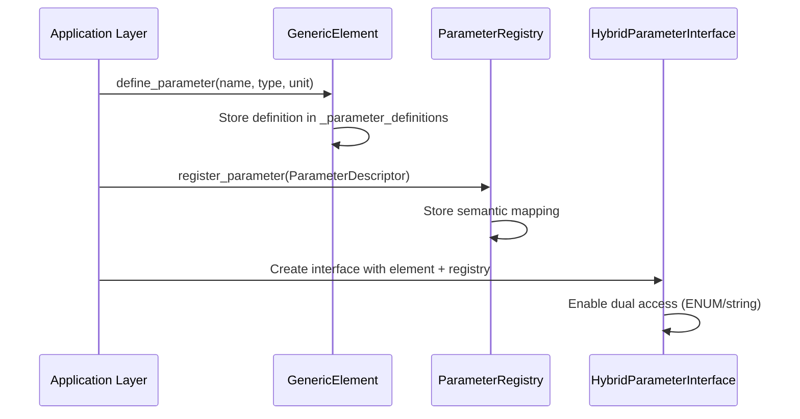
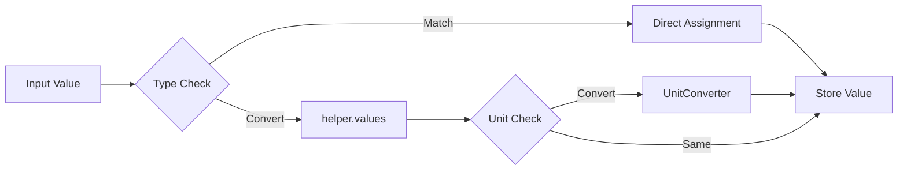
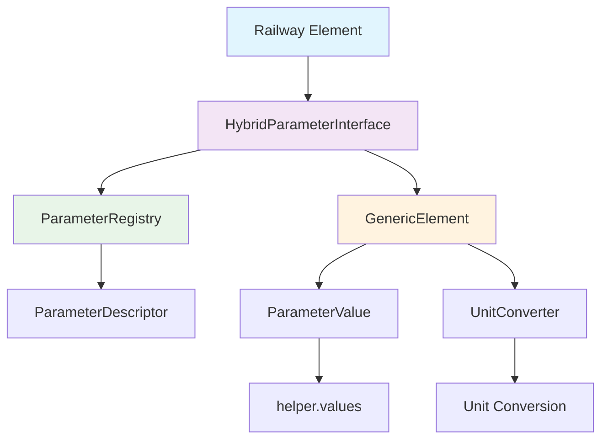
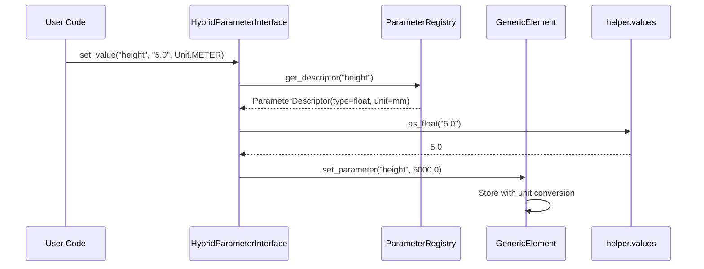

# PyM Core Implementation Documentation

## Overview

PyM Core is a sophisticated parameter management system that provides a flexible architecture for modeling infrastructure elements. The system separates parameter definitions from values, enabling type-safe operations, unit conversions, and multiple access patterns.

## Installation

```bash
# Install with uv (recommended)
uv pip install -e ".[dev]"

# Run tests
python -m pytest

# Run linting
ruff check
```

## Core Architecture

The system consists of several interconnected layers:

```
┌─────────────────────────────────────────────────────────────┐
│                    Application Layer                       │
│  (pymapp - Railway Infrastructure Elements)                │
├─────────────────────────────────────────────────────────────┤
│                    Interface Layer                         │
│  (HybridParameterInterface)                                │
├─────────────────────────────────────────────────────────────┤
│                     Core Layer                             │
│  (GenericElement, ParameterRegistry)                       │
├─────────────────────────────────────────────────────────────┤
│                   Storage Layer                            │
│  (ElementRepository, ContainerExtension)                   │
├─────────────────────────────────────────────────────────────┤
│                   Foundation Layer                         │
│  (Types, Units, Helper Functions)                          │
└─────────────────────────────────────────────────────────────┘
```

## 1. Parameter System Architecture

### 1.1 Parameter Definition vs. Value Separation

The core principle is the **separation of parameter definitions from their values**:

```python
# Parameter Definition (Schema)
ParameterDescriptor(
    semantic_key="height",
    data_type=float,
    unit=Unit.MILLIMETER,
    description="Element height above ground"
)

# Parameter Value (Instance Data)
ParameterValue(
    key="height",
    value=5000.0,
    original_unit=Unit.METER,  # Converted automatically
    current_unit=Unit.MILLIMETER
)
```

### 1.2 Parameter Creation Process



#### Step-by-Step Parameter Creation:

1. **Definition Phase** (`src/pymcore/generic_element.py:55`):
   ```python
   def define_parameter(self, name: str, value_type: ValueType, unit: Unit) -> None:
       """Define a parameter schema without setting a value."""
       descriptor = ParameterDescriptor(
           semantic_key=name,
           data_type=self._map_value_type(value_type),
           unit=unit
       )
       self._parameter_definitions[name] = descriptor
   ```

2. **Registration Phase** (`src/pymcore/parameter_registry.py:45`):
   ```python
   def register_parameter(self, descriptor: ParameterDescriptor) -> None:
       """Register parameter for semantic access."""
       self._descriptors[descriptor.semantic_key] = descriptor
   ```

3. **Interface Creation** (`src/pymcore/hybrid_parameter_interface.py:85`):
   ```python
   def __init__(self, element: GenericElement, mapping_name: str, registry: ParameterRegistry):
       self._element = element
       self._registry = registry
       # Enable both element.get_parameter("height") and element.get_value(RailwayParameters.HEIGHT)
   ```

### 1.3 Parameter Transformation Process

The system provides automatic type conversion and unit transformation:

```python
# Setting values with automatic conversion
interface.set_value("height", "5.0", Unit.METER)  # String to float, m to mm
interface.set_value("active", "true")              # String to boolean
interface.set_value("count", 42.0)                 # Float to int (if whole number)

# Getting values with type safety
height: float = interface.get_value("height", 0.0)
active: bool = interface.get_value("active", False)
```

#### Conversion Pipeline:



## 2. Registry System

### 2.1 Purpose and Function

The `ParameterRegistry` serves multiple critical functions:

1. **Semantic Mapping**: Maps ENUM values to parameter keys
2. **Type Safety**: Enforces data types through descriptors
3. **Validation**: Ensures parameter consistency
4. **Discovery**: Enables runtime parameter introspection

### 2.2 Registry Operations

```python
# Registration
registry.register_parameter(ParameterDescriptor(
    semantic_key=RailwayParameters.HEIGHT.value,  # "height"
    data_type=float,
    unit=Unit.MILLIMETER
))

# Lookup
descriptor = registry.get_descriptor("height")
if descriptor:
    expected_type = descriptor.data_type
    default_unit = descriptor.unit
```

### 2.3 Element Implementation Application

Element implementations use the registry for consistent parameter handling:

```python
class Pole(RailwayElement):
    def _setup_parameters(self, registry: ParameterRegistry) -> None:
        # Register domain-specific parameters
        registry.register_parameter(ParameterDescriptor(
            semantic_key=RailwayParameters.HEIGHT.value,
            data_type=float,
            unit=Unit.MILLIMETER,
            description="Pole height above ground"
        ))
    
    @property 
    def height(self) -> float:
        # Type-safe access through interface
        return self._interface.get_value(RailwayParameters.HEIGHT.value, 0.0)
```

## 3. Component Communication

### 3.1 Data Flow Architecture



### 3.2 Interface Communication Patterns

#### Pattern 1: ENUM-based Access
```python
# Application uses semantic enums
pole.set_height(5.0, Unit.METER)
height = pole.height  # Automatic unit conversion to mm
```

#### Pattern 2: String-based Access  
```python
# Direct parameter access
element.set_parameter("height", 5000.0)
height = element.get_parameter("height", 0.0)
```

#### Pattern 3: Hybrid Access
```python
# Interface bridges both patterns
interface.set_value(RailwayParameters.HEIGHT.value, 5.0, Unit.METER)
interface.set_value("height", 5000.0)  # Equivalent operations
```

## 4. Schema Definitions Usage

### 4.1 ParameterDescriptor Schema

```python
@dataclass
class ParameterDescriptor:
    semantic_key: str          # Unique identifier
    data_type: type           # Expected Python type
    unit: Unit               # Default unit
    description: str = ""    # Human-readable description
    default_value: Any = None  # Optional default
    validation_rules: List[str] = field(default_factory=list)
```

### 4.2 Schema Application Points

1. **Parameter Definition** (`src/pymcore/generic_element.py:55`):
   - Stores type and unit constraints
   - Validates parameter structure

2. **Registry Registration** (`src/pymcore/parameter_registry.py:45`):
   - Enables semantic lookup
   - Provides type information for validation

3. **Value Setting** (`src/pymcore/hybrid_parameter_interface.py:156`):
   - Enforces type conversion
   - Applies unit conversion
   - Validates against schema

4. **Repository Storage** (`src/pymcore/element_repository.py:85`):
   - Serializes with type information
   - Preserves schema metadata

### 4.3 Schema Validation Flow



## 5. Unit Conversion System

### 5.1 Automatic Unit Conversion

The system automatically converts between compatible units:

```python
# All equivalent operations resulting in 5000.0 mm
interface.set_value("height", 5.0, Unit.METER)        # 5 m → 5000 mm
interface.set_value("height", 500.0, Unit.CENTIMETER) # 500 cm → 5000 mm  
interface.set_value("height", 5000.0, Unit.MILLIMETER) # 5000 mm → 5000 mm
```

### 5.2 Unit Conversion Implementation

Located in `src/pymcore/unit_converter.py:25`:

```python
def convert_value(self, value: float, from_unit: Unit, to_unit: Unit) -> float:
    """Convert value between units with validation."""
    if from_unit == to_unit:
        return value
        
    # Define conversion factors
    conversion_factors = {
        (Unit.METER, Unit.MILLIMETER): 1000.0,
        (Unit.CENTIMETER, Unit.MILLIMETER): 10.0,
        # ... additional conversions
    }
    
    factor = conversion_factors.get((from_unit, to_unit))
    if factor is None:
        raise UnitConversionError(f"Cannot convert {from_unit} to {to_unit}")
        
    return value * factor
```

## 6. Type Conversion System

### 6.1 Helper Functions (`src/pymcore/helper/values.py`)

The helper module provides robust type conversion with validation:

```python
# Type guards with validation
if is_float(value):
    float_val = as_float(value)

# Safe conversions with error handling  
try:
    int_val = as_int("42.0")      # 42
    bool_val = as_bool("true")    # True
    str_val = as_str(123)         # "123"
except ValueConversionError as e:
    # Handle conversion failure
```

### 6.2 Conversion Matrix

| Input Type | `as_int()` | `as_float()` | `as_bool()` | `as_str()` |
|------------|------------|--------------|-------------|------------|
| `int` | ✓ | ✓ | 0/1 only | ✓ |
| `float` | whole only | ✓ | 0.0/1.0 only | ✓ |
| `str` | parseable | parseable | true/false/1/0 | ✓ |
| `bool` | 0/1 | 0.0/1.0 | ✓ | "True"/"False" |

## 7. Repository and Storage

### 7.1 Element Repository Pattern

The repository provides persistence and querying capabilities:

```python
class ElementRepository:
    def save(self, element: GenericElement) -> None:
        """Save element with full parameter metadata."""
        
    def get_by_id(self, element_id: str) -> Optional[GenericElement]:
        """Retrieve element by ID with parameter reconstruction."""
        
    def get_by_type(self, element_type: str) -> List[GenericElement]:
        """Query elements by type."""
```

### 7.2 Container Extension

Enables hierarchical relationships between elements:

```python
# Create parent-child relationships
container = ContainerExtension(parent_element)
container.add_child(child_element)

# Query relationships
children = container.get_children()
parent = container.get_parent()
```

## 8. Integration Patterns

### 8.1 Complete Element Creation

```python
# 1. Create core element
element = GenericElement("pole_001", "pole")

# 2. Define parameters
element.define_parameter("height", ValueType.FLOAT, Unit.MILLIMETER)

# 3. Setup registry  
registry = ParameterRegistry()
registry.register_parameter(ParameterDescriptor(
    semantic_key="height",
    data_type=float,
    unit=Unit.MILLIMETER
))

# 4. Create interface
interface = HybridParameterInterface(element, "pole_params", registry)

# 5. Set values with conversion
interface.set_value("height", 5.0, Unit.METER)  # → 5000.0 mm

# 6. Store in repository
repository = ElementRepository()
repository.save(element)
```

### 8.2 Application Layer Usage

```python
# High-level domain-specific usage
pole = Pole("pole_001")
pole.set_height(5.0, Unit.METER)
pole.set_diameter(200.0, Unit.MILLIMETER)
pole.set_material("steel")

# Repository operations
repository.save(pole.get_core_element())
```

## 9. Key Design Principles

### 9.1 Separation of Concerns
- **Definitions**: Schema and type information (ParameterDescriptor)
- **Values**: Instance data with units (ParameterValue)  
- **Access**: Multiple patterns through unified interface (HybridParameterInterface)

### 9.2 Type Safety
- Compile-time type checking through TypeGuards
- Runtime validation through conversion functions
- Schema enforcement through descriptors

### 9.3 Flexibility
- Multiple access patterns (ENUM, string, direct)
- Pluggable unit conversion system
- Extensible parameter types

### 9.4 Performance
- Lazy conversion (convert only when accessed)
- Caching of converted values
- Efficient storage format

## 10. Common Usage Patterns

### 10.1 Creating New Element Types

```python
class CustomElement(RailwayElement):
    def __init__(self, element_id: str):
        super().__init__(element_id, "custom")
    
    def _define_element_parameters(self) -> None:
        self._core_element.define_parameter("custom_param", ValueType.FLOAT, Unit.METER)
    
    def _setup_parameters(self, registry: ParameterRegistry) -> None:
        registry.register_parameter(ParameterDescriptor(
            semantic_key="custom_param",
            data_type=float,
            unit=Unit.METER
        ))
```

### 10.2 Batch Operations

```python
# Batch parameter setting
values = {
    "height": (5.0, Unit.METER),
    "diameter": (200.0, Unit.MILLIMETER),
    "material": ("steel", None)
}

for key, (value, unit) in values.items():
    interface.set_value(key, value, unit)
```

### 10.3 Parameter Introspection

```python
# Discover available parameters
element = GenericElement("test", "pole")
definitions = element.get_parameter_definitions()

for name, descriptor in definitions.items():
    print(f"{name}: {descriptor.data_type.__name__} ({descriptor.unit})")
```

## 11. Error Handling

The system provides comprehensive error handling:

- `ValueConversionError`: Type conversion failures
- `UnitConversionError`: Unit conversion issues  
- `ParameterNotFoundError`: Missing parameter access
- `ValidationError`: Schema validation failures

## 12. Performance Considerations

- Parameter definitions are cached for fast access
- Unit conversions are performed only when needed
- Type conversions use optimized helper functions
- Repository operations minimize serialization overhead

This architecture provides a robust foundation for parameter management while maintaining flexibility and type safety throughout the system.