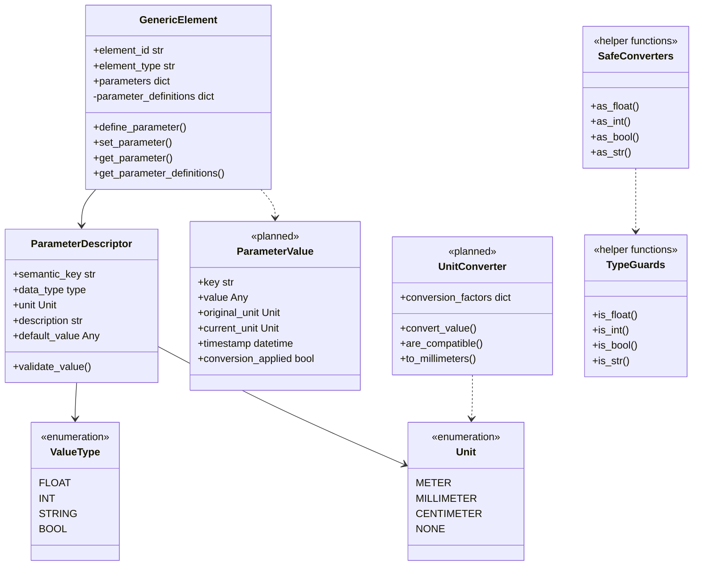
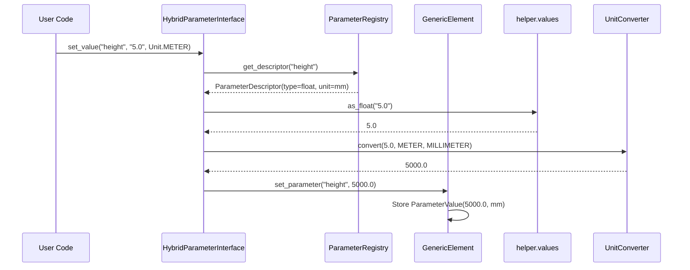
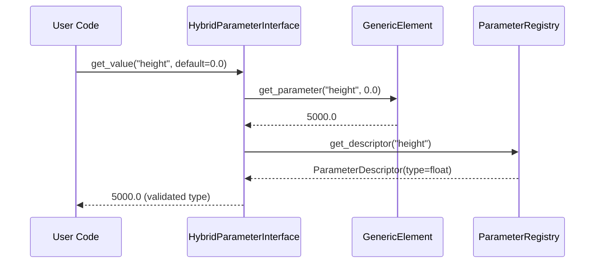

# Parameter System - Definition/Value Separation

> *"Falte Wissen in Daten, damit Programmlogik dumm und robust werden kann"* - Unix Philosophy

## 🎯 Core Principle

Das Parameter-System von PyM Core basiert auf der **strikten Trennung von Parameter-Definitionen und Parameter-Werten**. Diese Separation ermöglicht Type Safety, Unit Conversion, und flexible Validation.

## 📊 Architecture Overview



## 🔧 Parameter Definition (Schema)

### ParameterDescriptor Structure

**Location**: `src/pymcore/parameter_descriptor.py`

```python
@dataclass
class ParameterDescriptor:
    semantic_key: str          # Unique identifier ("height", "material")
    data_type: type           # Expected Python type (float, int, str, bool)
    unit: Unit               # Default/expected unit (Unit.MILLIMETER)
    description: str = ""    # Human-readable description
    default_value: Any = None  # Optional fallback value
    validation_rules: List[str] = field(default_factory=list)
```

### Parameter Definition Process

```python
# Step 1: Create descriptor
descriptor = ParameterDescriptor(
    semantic_key="height",
    data_type=float,
    unit=Unit.MILLIMETER,
    description="Element height above ground",
    default_value=0.0
)

# Step 2: Register in GenericElement
element.define_parameter("height", ValueType.FLOAT, Unit.MILLIMETER)

# Step 3: Register in ParameterRegistry
registry.register_parameter(descriptor)
```

### Schema Benefits

```python
# Type Safety: Descriptor knows expected type
descriptor = registry.get_descriptor("height")
if descriptor and descriptor.data_type == float:
    # Safe to perform float operations
    converted_value = as_float(raw_input, descriptor.default_value)

# Unit Awareness: Descriptor knows expected unit
if descriptor.unit == Unit.MILLIMETER:
    # Convert input to millimeters if needed
    mm_value = unit_converter.to_millimeters(value, input_unit)

# Validation: Descriptor can enforce rules
if descriptor.validation_rules:
    for rule in descriptor.validation_rules:
        if not validate_rule(value, rule):
            raise ValidationError(f"Value {value} violates rule: {rule}")
```

## 🗄️ Parameter Values (Instance Data)

### ParameterValue Structure

```python
@dataclass
class ParameterValue:
    key: str                  # Parameter identifier
    value: Any               # Current value
    original_unit: Unit      # Unit of input value
    current_unit: Unit       # Unit of stored value
    timestamp: datetime      # When value was set
    conversion_applied: bool  # Whether unit conversion occurred
```

### Value Storage Pattern

```python
class GenericElement:
    def set_parameter(self, key: str, value: Any, unit: Unit = None) -> None:
        """Store parameter value with metadata."""

        # Get parameter definition for validation
        descriptor = self._parameter_definitions.get(key)

        if descriptor:
            # Apply type conversion
            converted_value = self._convert_to_type(value, descriptor.data_type)

            # Apply unit conversion if needed
            if unit and unit != descriptor.unit:
                converted_value = self._convert_units(converted_value, unit, descriptor.unit)
                unit_converted = True
            else:
                unit_converted = False

            # Store with metadata
            self.parameters[key] = ParameterValue(
                key=key,
                value=converted_value,
                original_unit=unit or descriptor.unit,
                current_unit=descriptor.unit,
                timestamp=datetime.now(),
                conversion_applied=unit_converted
            )
        else:
            # Store without schema validation (flexible mode)
            self.parameters[key] = value
```

## 🔄 Type Conversion System

### Helper Functions (`src/pymcore/helper/values.py`)

```python
# Type Guards (Non-destructive checking)
def is_float(value: Any) -> bool:
    """Check if value can be converted to float."""
    if isinstance(value, (int, float)):
        return True
    if isinstance(value, str):
        try:
            float(value)
            return True
        except ValueError:
            return False
    return False

def is_int(value: Any) -> bool:
    """Check if value can be converted to int."""
    if isinstance(value, int):
        return True
    if isinstance(value, float) and value.is_integer():
        return True
    if isinstance(value, str):
        try:
            int(value)
            return True
        except ValueError:
            return False
    return False

def is_bool(value: Any) -> bool:
    """Check if value can be converted to bool."""
    if isinstance(value, bool):
        return True
    if isinstance(value, str) and value.lower() in ('true', 'false', '1', '0'):
        return True
    if isinstance(value, (int, float)) and value in (0, 1, 0.0, 1.0):
        return True
    return False
```

### Safe Conversions

```python
# Safe Conversion Functions (With fallbacks)
def as_float(value: Any, fallback: float = 0.0) -> float:
    """Convert value to float with fallback."""
    if isinstance(value, (int, float)):
        return float(value)
    if isinstance(value, str):
        try:
            return float(value)
        except ValueError:
            return fallback
    return fallback

def as_int(value: Any, fallback: int = 0) -> int:
    """Convert value to int with fallback."""
    if isinstance(value, int):
        return value
    if isinstance(value, float) and value.is_integer():
        return int(value)
    if isinstance(value, str):
        try:
            # Try direct int conversion first
            return int(value)
        except ValueError:
            try:
                # Try float conversion then int
                float_val = float(value)
                if float_val.is_integer():
                    return int(float_val)
            except ValueError:
                pass
    return fallback

def as_bool(value: Any, fallback: bool = False) -> bool:
    """Convert value to bool with fallback."""
    if isinstance(value, bool):
        return value
    if isinstance(value, str):
        lower_val = value.lower()
        if lower_val in ('true', '1'):
            return True
        elif lower_val in ('false', '0'):
            return False
    if isinstance(value, (int, float)):
        if value == 1 or value == 1.0:
            return True
        elif value == 0 or value == 0.0:
            return False
    return fallback

def as_str(value: Any, fallback: str = "") -> str:
    """Convert value to string with fallback."""
    if value is None:
        return fallback
    return str(value)
```

### Conversion Matrix

| Input | `as_int()` | `as_float()` | `as_bool()` | `as_str()` |
|-------|------------|--------------|-------------|------------|
| `42` | `42` | `42.0` | `False` (not 1) | `"42"` |
| `42.0` | `42` | `42.0` | `False` (not 1.0) | `"42.0"` |
| `1` | `1` | `1.0` | `True` | `"1"` |
| `1.0` | `1` | `1.0` | `True` | `"1.0"` |
| `"42"` | `42` | `42.0` | `False` | `"42"` |
| `"42.5"` | `fallback` | `42.5` | `False` | `"42.5"` |
| `"true"` | `fallback` | `fallback` | `True` | `"true"` |
| `"false"` | `fallback` | `fallback` | `False` | `"false"` |
| `True` | `1` | `1.0` | `True` | `"True"` |
| `False` | `0` | `0.0` | `False` | `"False"` |

## 🔧 Unit Conversion System

### UnitConverter (`src/pymcore/unit_converter.py:25`)

```python
class UnitConverter:
    """Handles unit conversions with validation."""

    def __init__(self):
        self.conversion_factors = {
            # Length conversions to millimeters
            (Unit.METER, Unit.MILLIMETER): 1000.0,
            (Unit.CENTIMETER, Unit.MILLIMETER): 10.0,
            (Unit.MILLIMETER, Unit.MILLIMETER): 1.0,

            # Reverse conversions
            (Unit.MILLIMETER, Unit.METER): 0.001,
            (Unit.MILLIMETER, Unit.CENTIMETER): 0.1,

            # Area conversions (if needed)
            (Unit.SQUARE_METER, Unit.SQUARE_MILLIMETER): 1_000_000.0,
        }

    def convert_value(self, value: float, from_unit: Unit, to_unit: Unit) -> float:
        """Convert value between compatible units."""
        if from_unit == to_unit:
            return value

        factor = self.conversion_factors.get((from_unit, to_unit))
        if factor is None:
            raise UnitConversionError(f"Cannot convert {from_unit} to {to_unit}")

        return value * factor

    def are_compatible(self, unit1: Unit, unit2: Unit) -> bool:
        """Check if two units can be converted."""
        return (unit1, unit2) in self.conversion_factors or unit1 == unit2
```

### Automatic Unit Conversion

```python
# All these operations result in 5000.0 mm stored internally
interface.set_value("height", 5.0, Unit.METER)        # 5 m → 5000 mm
interface.set_value("height", 500.0, Unit.CENTIMETER) # 500 cm → 5000 mm
interface.set_value("height", 5000.0, Unit.MILLIMETER) # 5000 mm → 5000 mm

# Conversion is transparent to user
height_in_mm = interface.get_value("height")           # → 5000.0
height_in_m = interface.get_value("height", Unit.METER) # → 5.0 (future feature)
```

## 🔄 Complete Parameter Flow

### Setting Parameter Values



### Getting Parameter Values



## 🎯 Integration Patterns

### Parameter Definition Registration

```python
class RailwayElementSetup:
    """Standard setup for railway elements."""

    def setup_pole_parameters(self, element: GenericElement, registry: ParameterRegistry):
        # Define in element
        element.define_parameter("height", ValueType.FLOAT, Unit.MILLIMETER)
        element.define_parameter("diameter", ValueType.FLOAT, Unit.MILLIMETER)
        element.define_parameter("material", ValueType.STRING, Unit.NONE)
        element.define_parameter("foundation_depth", ValueType.FLOAT, Unit.MILLIMETER)

        # Register in registry
        registry.register_parameter(ParameterDescriptor(
            semantic_key="height",
            data_type=float,
            unit=Unit.MILLIMETER,
            description="Pole height above ground level"
        ))

        registry.register_parameter(ParameterDescriptor(
            semantic_key="diameter",
            data_type=float,
            unit=Unit.MILLIMETER,
            description="Pole diameter at base"
        ))

        # ... more registrations
```

### Batch Parameter Operations

```python
class BatchParameterOperations:
    """Efficient batch parameter handling."""

    def set_multiple_parameters(self, element: GenericElement, values: Dict[str, Tuple[Any, Unit]]):
        """Set multiple parameters efficiently."""
        for key, (value, unit) in values.items():
            element.set_parameter(key, value, unit)

    def validate_all_parameters(self, element: GenericElement, registry: ParameterRegistry) -> List[str]:
        """Validate all parameters against registry."""
        errors = []

        for key, value in element.get_all_parameters().items():
            descriptor = registry.get_descriptor(key)
            if descriptor:
                # Type validation
                if not isinstance(value, descriptor.data_type):
                    try:
                        # Attempt conversion
                        converted = self._convert_to_type(value, descriptor.data_type)
                        element.set_parameter(key, converted)
                    except ValueError:
                        errors.append(f"Cannot convert {key}={value} to {descriptor.data_type}")

                # Unit validation
                if hasattr(value, 'current_unit') and value.current_unit != descriptor.unit:
                    errors.append(f"Unit mismatch for {key}: expected {descriptor.unit}, got {value.current_unit}")

        return errors
```

## 🧪 Testing Strategies

### Parameter Definition Testing

```python
def test_parameter_definition():
    element = GenericElement("test", "pole")

    # Test definition
    element.define_parameter("height", ValueType.FLOAT, Unit.MILLIMETER)

    # Verify definition exists
    definitions = element.get_parameter_definitions()
    assert "height" in definitions
    assert definitions["height"].data_type == float
    assert definitions["height"].unit == Unit.MILLIMETER

def test_parameter_value_conversion():
    element = GenericElement("test", "pole")
    element.define_parameter("height", ValueType.FLOAT, Unit.MILLIMETER)

    # Test various input types
    element.set_parameter("height", "5000")    # String → float
    assert element.get_parameter("height") == 5000.0

    element.set_parameter("height", 5.0)       # Already float
    assert element.get_parameter("height") == 5.0

    element.set_parameter("height", 5)         # Int → float
    assert element.get_parameter("height") == 5.0
```

### Unit Conversion Testing

```python
def test_unit_conversion():
    converter = UnitConverter()

    # Test basic conversions
    assert converter.convert_value(5.0, Unit.METER, Unit.MILLIMETER) == 5000.0
    assert converter.convert_value(500.0, Unit.CENTIMETER, Unit.MILLIMETER) == 5000.0
    assert converter.convert_value(5000.0, Unit.MILLIMETER, Unit.MILLIMETER) == 5000.0

    # Test reverse conversions
    assert converter.convert_value(5000.0, Unit.MILLIMETER, Unit.METER) == 5.0

    # Test incompatible units
    with pytest.raises(UnitConversionError):
        converter.convert_value(5.0, Unit.METER, Unit.KILOGRAM)
```

## ⚡ Performance Optimization

### Lazy Conversion

```python
class LazyParameterValue:
    """Parameter value with lazy type/unit conversion."""

    def __init__(self, raw_value: Any, descriptor: ParameterDescriptor):
        self.raw_value = raw_value
        self.descriptor = descriptor
        self._converted_value = None
        self._conversion_applied = False

    @property
    def value(self) -> Any:
        """Get converted value (lazy evaluation)."""
        if not self._conversion_applied:
            self._converted_value = self._apply_conversions()
            self._conversion_applied = True
        return self._converted_value

    def _apply_conversions(self) -> Any:
        # Apply type conversion
        type_converted = self._convert_type(self.raw_value, self.descriptor.data_type)

        # Apply unit conversion if needed
        # ... unit conversion logic

        return type_converted
```

### Conversion Caching

```python
class CachedConverter:
    """Converter with result caching for performance."""

    def __init__(self):
        self._conversion_cache = {}
        self._type_cache = {}

    def convert_with_cache(self, value: Any, from_type: type, to_type: type) -> Any:
        cache_key = (id(value), from_type, to_type)

        if cache_key not in self._type_cache:
            self._type_cache[cache_key] = self._perform_conversion(value, from_type, to_type)

        return self._type_cache[cache_key]
```

## 🚀 Future Extensions

### Advanced Validation

```python
@dataclass
class AdvancedParameterDescriptor(ParameterDescriptor):
    min_value: Optional[float] = None
    max_value: Optional[float] = None
    allowed_values: Optional[List[Any]] = None
    validation_function: Optional[Callable[[Any], bool]] = None

    def validate_value(self, value: Any) -> bool:
        # Range validation
        if self.min_value is not None and value < self.min_value:
            return False
        if self.max_value is not None and value > self.max_value:
            return False

        # Allowed values validation
        if self.allowed_values is not None and value not in self.allowed_values:
            return False

        # Custom validation
        if self.validation_function and not self.validation_function(value):
            return False

        return True
```

### Computed Parameters

```python
class ComputedParameterDescriptor(ParameterDescriptor):
    """Parameter that computes its value from other parameters."""

    def __init__(self, computation_formula: str, dependencies: List[str], **kwargs):
        super().__init__(**kwargs)
        self.formula = computation_formula
        self.dependencies = dependencies

    def compute_value(self, element: GenericElement) -> Any:
        # Get dependency values
        dep_values = {dep: element.get_parameter(dep) for dep in self.dependencies}

        # Evaluate formula (safely)
        return self._safe_eval(self.formula, dep_values)
```

## 📚 Related Documentation

- **[GenericElement](./generic-element.md)** - Universal container implementation
- **[Registry System](./registry-system.md)** - Parameter registration and lookup
- **[HybridParameterInterface](../interfaces/hybrid-parameter.md)** - Unified access patterns
- **[Type Conversion](../interfaces/type-conversion.md)** - Helper functions deep-dive

---

**Das Parameter-System implementiert Unix-Weisheit: Daten und Programme sind getrennt, wodurch beide robust und flexibel werden.** 🔧⚡
