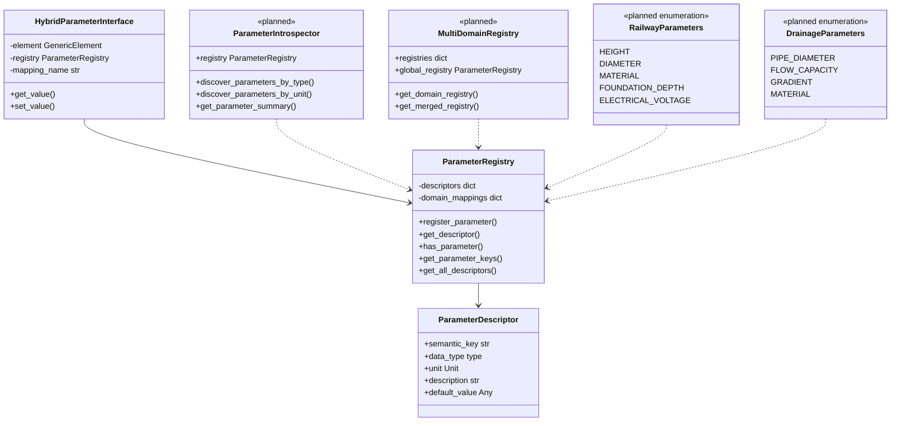

# Registry System - Semantic Parameter Mapping

> *"Schreibe Programme so, dass sie sich mit anderen Programmen verbinden lassen"* - Registry als universelle Übersetzungsschicht

## 🎯 Purpose

Das `ParameterRegistry` ist die **zentrale Übersetzungsschicht** zwischen verschiedenen Parameter-Zugriffsmuster. Es ermöglicht:

- **ENUM ↔ String Mapping**: `RailwayParameters.HEIGHT` ↔ `"height"`
- **Type Safety**: Validation durch ParameterDescriptor
- **Schema Discovery**: Runtime Parameter-Introspection
- **Cross-Domain Compatibility**: Einheitliche Parameter-Semantik

## 🏗️ Architecture Overview



## 🔧 Core Implementation

### ParameterRegistry Class

**Location**: `src/pymcore/parameter_registry.py:45`

```python
class ParameterRegistry:
    """Central registry for parameter definitions and semantic mappings."""

    def __init__(self):
        self._descriptors: Dict[str, ParameterDescriptor] = {}
        self._domain_mappings: Dict[str, Dict[str, str]] = {}

    def register_parameter(self, descriptor: ParameterDescriptor) -> None:
        """Register parameter descriptor for semantic access."""
        self._descriptors[descriptor.semantic_key] = descriptor

    def get_descriptor(self, semantic_key: str) -> Optional[ParameterDescriptor]:
        """Get parameter descriptor by semantic key."""
        return self._descriptors.get(semantic_key)

    def get_all_descriptors(self) -> Dict[str, ParameterDescriptor]:
        """Get all registered parameter descriptors."""
        return self._descriptors.copy()
```

### Registration Process

```python
# Step 1: Create ParameterDescriptor
height_descriptor = ParameterDescriptor(
    semantic_key="height",           # String key for lookup
    data_type=float,                # Expected Python type
    unit=Unit.MILLIMETER,           # Default unit
    description="Element height above ground level",
    default_value=0.0
)

# Step 2: Register in Registry
registry = ParameterRegistry()
registry.register_parameter(height_descriptor)

# Step 3: Registry enables lookups
descriptor = registry.get_descriptor("height")
assert descriptor.data_type == float
assert descriptor.unit == Unit.MILLIMETER
```

## 🔄 ENUM ↔ String Mapping

### ENUM Definition Pattern

```python
# Railway-specific parameter enums
class RailwayParameters(Enum):
    HEIGHT = "height"
    DIAMETER = "diameter"
    MATERIAL = "material"
    FOUNDATION_DEPTH = "foundation_depth"
    ELECTRICAL_VOLTAGE = "electrical_voltage"

# Drainage-specific parameter enums (future)
class DrainageParameters(Enum):
    PIPE_DIAMETER = "pipe_diameter"
    FLOW_CAPACITY = "flow_capacity"
    GRADIENT = "gradient"
    MATERIAL = "material"  # Same semantic key, different domain
```

### Semantic Mapping Usage

```python
# Both access patterns work identically
interface = HybridParameterInterface(element, registry)

# ENUM-based access (type-safe, semantic)
height1 = interface.get_value(RailwayParameters.HEIGHT.value, 0.0)

# String-based access (flexible, generic)
height2 = interface.get_value("height", 0.0)

# Registry ensures consistency
assert height1 == height2
assert registry.get_descriptor("height") == registry.get_descriptor(RailwayParameters.HEIGHT.value)
```

## 🎯 Registry Operations

### Basic Operations

```python
class ParameterRegistry:
    def register_parameter(self, descriptor: ParameterDescriptor) -> None:
        """Register new parameter descriptor."""
        self._descriptors[descriptor.semantic_key] = descriptor

    def unregister_parameter(self, semantic_key: str) -> bool:
        """Remove parameter descriptor."""
        if semantic_key in self._descriptors:
            del self._descriptors[semantic_key]
            return True
        return False

    def has_parameter(self, semantic_key: str) -> bool:
        """Check if parameter is registered."""
        return semantic_key in self._descriptors

    def get_parameter_keys(self) -> List[str]:
        """Get all registered parameter keys."""
        return list(self._descriptors.keys())
```

### Bulk Operations

```python
def register_domain_parameters(self, domain_name: str, descriptors: List[ParameterDescriptor]) -> None:
    """Register multiple parameters for a domain."""
    registered_keys = []

    try:
        for descriptor in descriptors:
            self.register_parameter(descriptor)
            registered_keys.append(descriptor.semantic_key)

        # Track domain registration
        self._domain_mappings[domain_name] = {desc.semantic_key: desc.semantic_key for desc in descriptors}

    except Exception as e:
        # Rollback on failure
        for key in registered_keys:
            self.unregister_parameter(key)
        raise RegistrationError(f"Failed to register domain {domain_name}: {e}")

def get_domain_parameters(self, domain_name: str) -> Dict[str, ParameterDescriptor]:
    """Get all parameters for a specific domain."""
    domain_keys = self._domain_mappings.get(domain_name, {})
    return {key: self._descriptors[key] for key in domain_keys if key in self._descriptors}
```

## 🔍 Parameter Discovery & Introspection

### Runtime Parameter Discovery

```python
class ParameterIntrospector:
    """Helper for parameter discovery and analysis."""

    def __init__(self, registry: ParameterRegistry):
        self.registry = registry

    def discover_parameters_by_type(self, data_type: type) -> List[ParameterDescriptor]:
        """Find all parameters of specific type."""
        return [
            desc for desc in self.registry.get_all_descriptors().values()
            if desc.data_type == data_type
        ]

    def discover_parameters_by_unit(self, unit: Unit) -> List[ParameterDescriptor]:
        """Find all parameters with specific unit."""
        return [
            desc for desc in self.registry.get_all_descriptors().values()
            if desc.unit == unit
        ]

    def get_parameter_summary(self) -> Dict[str, Dict[str, Any]]:
        """Get comprehensive parameter summary."""
        summary = {}
        for key, desc in self.registry.get_all_descriptors().items():
            summary[key] = {
                "type": desc.data_type.__name__,
                "unit": desc.unit.value,
                "description": desc.description,
                "has_default": desc.default_value is not None
            }
        return summary
```

### Usage Examples

```python
# Create introspector
introspector = ParameterIntrospector(registry)

# Find all length parameters
length_params = introspector.discover_parameters_by_unit(Unit.MILLIMETER)
print(f"Length parameters: {[p.semantic_key for p in length_params]}")

# Find all float parameters
float_params = introspector.discover_parameters_by_type(float)
print(f"Numeric parameters: {[p.semantic_key for p in float_params]}")

# Get comprehensive overview
summary = introspector.get_parameter_summary()
for key, info in summary.items():
    print(f"{key}: {info['type']} ({info['unit']}) - {info['description']}")
```

## 🎭 Registry Integration Patterns

### With HybridParameterInterface

```python
class HybridParameterInterface:
    def __init__(self, element: GenericElement, mapping_name: str, registry: ParameterRegistry):
        self._element = element
        self._registry = registry
        self._mapping_name = mapping_name

    def get_value(self, key: Union[str, Enum], default: Any = None) -> Any:
        """Get parameter value with registry-based validation."""
        # Convert ENUM to string if needed
        str_key = key.value if isinstance(key, Enum) else key

        # Get descriptor for type validation
        descriptor = self._registry.get_descriptor(str_key)

        # Get value from element
        value = self._element.get_parameter(str_key, default)

        # Apply type validation if descriptor exists
        if descriptor and value != default:
            if not isinstance(value, descriptor.data_type):
                # Attempt type conversion
                try:
                    value = self._convert_to_type(value, descriptor.data_type)
                except ValueError:
                    return default

        return value
```

### With Element Factory

```python
class ElementFactory:
    """Factory with registry-driven parameter setup."""

    def __init__(self, registry: ParameterRegistry):
        self.registry = registry

    def create_element_with_schema(self, element_id: str, element_type: str,
                                 parameter_schema: List[str]) -> GenericElement:
        """Create element with registry-defined parameters."""
        element = GenericElement(element_id, element_type)

        # Define parameters based on registry schema
        for param_key in parameter_schema:
            descriptor = self.registry.get_descriptor(param_key)
            if descriptor:
                # Convert type back to ValueType enum
                value_type = self._type_to_value_type(descriptor.data_type)
                element.define_parameter(param_key, value_type, descriptor.unit)

                # Set default value if available
                if descriptor.default_value is not None:
                    element.set_parameter(param_key, descriptor.default_value)

        return element

    def _type_to_value_type(self, python_type: type) -> ValueType:
        """Convert Python type back to ValueType enum."""
        type_mapping = {
            float: ValueType.FLOAT,
            int: ValueType.INT,
            str: ValueType.STRING,
            bool: ValueType.BOOL
        }
        return type_mapping.get(python_type, ValueType.STRING)
```

## 🔧 Domain-Specific Registry Setup

### Railway Domain Setup

```python
class RailwayRegistrySetup:
    """Standard railway parameter registry setup."""

    @staticmethod
    def setup_railway_registry() -> ParameterRegistry:
        """Create and populate railway parameter registry."""
        registry = ParameterRegistry()

        # Pole parameters
        registry.register_parameter(ParameterDescriptor(
            semantic_key=RailwayParameters.HEIGHT.value,
            data_type=float,
            unit=Unit.MILLIMETER,
            description="Pole height above ground level",
            default_value=6000.0
        ))

        registry.register_parameter(ParameterDescriptor(
            semantic_key=RailwayParameters.DIAMETER.value,
            data_type=float,
            unit=Unit.MILLIMETER,
            description="Pole diameter at base",
            default_value=200.0
        ))

        registry.register_parameter(ParameterDescriptor(
            semantic_key=RailwayParameters.MATERIAL.value,
            data_type=str,
            unit=Unit.NONE,
            description="Pole material specification",
            default_value="steel"
        ))

        registry.register_parameter(ParameterDescriptor(
            semantic_key=RailwayParameters.FOUNDATION_DEPTH.value,
            data_type=float,
            unit=Unit.MILLIMETER,
            description="Foundation depth below ground",
            default_value=900.0
        ))

        # Track domain mapping
        registry._domain_mappings["railway_poles"] = {
            desc.semantic_key: desc.semantic_key
            for desc in [registry.get_descriptor(param.value)
                        for param in RailwayParameters]
        }

        return registry
```

### Multi-Domain Registry

```python
class MultiDomainRegistry:
    """Registry supporting multiple infrastructure domains."""

    def __init__(self):
        self.registries = {
            "railway": RailwayRegistrySetup.setup_railway_registry(),
            # "drainage": DrainageRegistrySetup.setup_drainage_registry(),  # Future
            # "building": BuildingRegistrySetup.setup_building_registry(),   # Future
        }
        self.global_registry = ParameterRegistry()

    def get_domain_registry(self, domain: str) -> Optional[ParameterRegistry]:
        """Get registry for specific domain."""
        return self.registries.get(domain)

    def get_merged_registry(self) -> ParameterRegistry:
        """Get registry with all domain parameters merged."""
        merged = ParameterRegistry()

        for domain, registry in self.registries.items():
            for key, descriptor in registry.get_all_descriptors().items():
                # Handle name conflicts by prefixing with domain
                merged_key = key if not merged.has_parameter(key) else f"{domain}_{key}"

                merged_descriptor = ParameterDescriptor(
                    semantic_key=merged_key,
                    data_type=descriptor.data_type,
                    unit=descriptor.unit,
                    description=f"[{domain}] {descriptor.description}",
                    default_value=descriptor.default_value
                )
                merged.register_parameter(merged_descriptor)

        return merged
```

## 🧪 Testing Strategies

### Registry Testing

```python
def test_parameter_registration():
    registry = ParameterRegistry()

    # Test registration
    descriptor = ParameterDescriptor("height", float, Unit.MILLIMETER)
    registry.register_parameter(descriptor)

    # Test retrieval
    retrieved = registry.get_descriptor("height")
    assert retrieved is not None
    assert retrieved.semantic_key == "height"
    assert retrieved.data_type == float
    assert retrieved.unit == Unit.MILLIMETER

def test_enum_string_mapping():
    registry = RailwayRegistrySetup.setup_railway_registry()

    # Test ENUM access
    height_desc_enum = registry.get_descriptor(RailwayParameters.HEIGHT.value)

    # Test string access
    height_desc_string = registry.get_descriptor("height")

    # Should be identical
    assert height_desc_enum == height_desc_string
    assert height_desc_enum.data_type == float

def test_parameter_discovery():
    registry = RailwayRegistrySetup.setup_railway_registry()
    introspector = ParameterIntrospector(registry)

    # Test type-based discovery
    float_params = introspector.discover_parameters_by_type(float)
    assert len(float_params) >= 3  # height, diameter, foundation_depth

    # Test unit-based discovery
    mm_params = introspector.discover_parameters_by_unit(Unit.MILLIMETER)
    assert len(mm_params) >= 3
```

### Integration Testing

```python
def test_registry_with_hybrid_interface():
    # Setup
    registry = RailwayRegistrySetup.setup_railway_registry()
    element = GenericElement("test_pole", "pole")

    # Define parameters in element to match registry
    element.define_parameter("height", ValueType.FLOAT, Unit.MILLIMETER)

    # Create interface
    interface = HybridParameterInterface(element, "pole_params", registry)

    # Test ENUM access
    interface.set_value(RailwayParameters.HEIGHT.value, 6000.0)
    height_enum = interface.get_value(RailwayParameters.HEIGHT.value)

    # Test string access
    height_string = interface.get_value("height")

    # Should be identical
    assert height_enum == height_string == 6000.0
```

## ⚡ Performance Optimization

### Registry Caching

```python
class CachedParameterRegistry(ParameterRegistry):
    """Registry with lookup caching for performance."""

    def __init__(self):
        super().__init__()
        self._lookup_cache = {}
        self._cache_hits = 0
        self._cache_misses = 0

    def get_descriptor(self, semantic_key: str) -> Optional[ParameterDescriptor]:
        """Get descriptor with caching."""
        if semantic_key in self._lookup_cache:
            self._cache_hits += 1
            return self._lookup_cache[semantic_key]

        descriptor = super().get_descriptor(semantic_key)
        self._lookup_cache[semantic_key] = descriptor
        self._cache_misses += 1
        return descriptor

    def register_parameter(self, descriptor: ParameterDescriptor) -> None:
        """Register parameter and update cache."""
        super().register_parameter(descriptor)
        self._lookup_cache[descriptor.semantic_key] = descriptor

    def get_cache_stats(self) -> Dict[str, int]:
        """Get cache performance statistics."""
        total = self._cache_hits + self._cache_misses
        hit_rate = self._cache_hits / total if total > 0 else 0
        return {
            "hits": self._cache_hits,
            "misses": self._cache_misses,
            "hit_rate": hit_rate
        }
```

## 🚀 Future Extensions

### Validation Registry

```python
class ValidationRegistry(ParameterRegistry):
    """Registry with parameter validation rules."""

    def register_validation_rule(self, semantic_key: str, rule: Callable[[Any], bool]) -> None:
        """Register validation rule for parameter."""
        descriptor = self.get_descriptor(semantic_key)
        if descriptor:
            if not hasattr(descriptor, 'validation_rules'):
                descriptor.validation_rules = []
            descriptor.validation_rules.append(rule)

    def validate_parameter(self, semantic_key: str, value: Any) -> Tuple[bool, List[str]]:
        """Validate parameter value against registered rules."""
        descriptor = self.get_descriptor(semantic_key)
        if not descriptor:
            return True, []

        errors = []
        for rule in getattr(descriptor, 'validation_rules', []):
            try:
                if not rule(value):
                    errors.append(f"Validation rule failed for {semantic_key}={value}")
            except Exception as e:
                errors.append(f"Validation error for {semantic_key}: {e}")

        return len(errors) == 0, errors
```

### Dynamic Registry Loading

```python
class DynamicRegistryLoader:
    """Load parameter registries from configuration files."""

    def load_from_json(self, config_file: str) -> ParameterRegistry:
        """Load registry from JSON configuration."""
        with open(config_file, 'r') as f:
            config = json.load(f)

        registry = ParameterRegistry()

        for param_config in config.get("parameters", []):
            descriptor = ParameterDescriptor(
                semantic_key=param_config["key"],
                data_type=eval(param_config["type"]),  # TODO: Safer evaluation
                unit=Unit(param_config["unit"]),
                description=param_config.get("description", ""),
                default_value=param_config.get("default")
            )
            registry.register_parameter(descriptor)

        return registry
```

## 📚 Related Documentation

- **[Parameter System](./parameter-system.md)** - Definition/value separation concepts
- **[GenericElement](./generic-element.md)** - Universal container implementation
- **[HybridParameterInterface](../interfaces/hybrid-parameter.md)** - Unified access patterns
- **[Railway Elements](../application/railway-elements.md)** - Domain-specific usage

---

**Das Registry-System ist die Unix-Pipe für Parameter: Es verbindet verschiedene Programme (Zugriffsmuster) durch eine universelle Schnittstelle.** 🔄⚡
