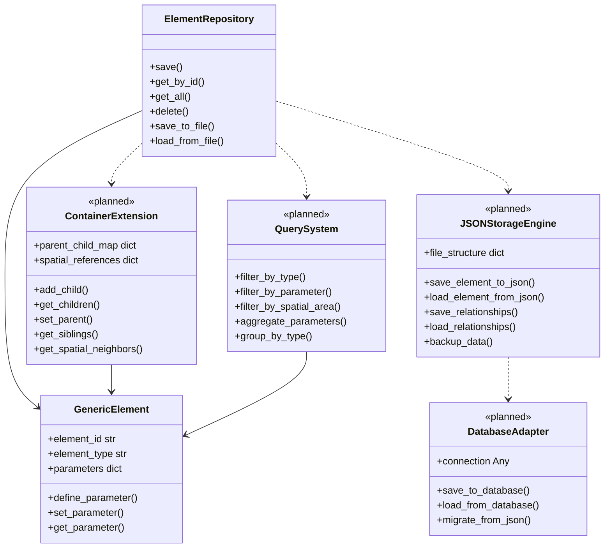

# Repository Patterns - JSON-First Persistence

> *"Verwende einfache Textdateien als Datenschnittstelle"* - Unix-Prinzip für transparente Datenhaltung

## 🎯 Philosophy: JSON-First Strategy

PyM Core folgt einer **JSON-First, Database-Later** Strategie, die Unix-Prinzipien der Transparenz und Einfachheit verkörpert:

- **Transparenz**: Alle Daten sind menschenlesbar und inspizierbar
- **Debugging**: File-basierte Analyse mit Standard-Unix-Tools
- **Portabilität**: Plattform- und toolunabhängige Datenhaltung
- **Skalierbarkeit**: Einfacher Übergang zu Datenbanken wenn nötig

## 🏗️ Architecture Overview



## 🗄️ ElementRepository Implementation

### Core Repository Interface

**Location**: `src/pymcore/element_repository.py:85`

```python
from typing import Protocol, List, Optional
from pathlib import Path
import json
from uuid import uuid4

class IElementRepository(Protocol):
    """Repository interface for GenericElement storage."""

    def save(self, element: GenericElement) -> None:
        """Save element to storage."""
        ...

    def get_by_id(self, element_id: str) -> Optional[GenericElement]:
        """Retrieve element by ID."""
        ...

    def get_by_type(self, element_type: str) -> List[GenericElement]:
        """Retrieve all elements of specific type."""
        ...

    def get_all(self) -> List[GenericElement]:
        """Retrieve all elements."""
        ...

    def delete(self, element_id: str) -> bool:
        """Delete element by ID."""
        ...

    def query(self, predicate: Callable[[GenericElement], bool]) -> List[GenericElement]:
        """Query elements with custom predicate."""
        ...
```

### JSON-Based Implementation

```python
class ElementRepository:
    """JSON-first repository implementation."""

    def __init__(self, storage_path: str = "./data/elements"):
        self.storage_path = Path(storage_path)
        self.storage_path.mkdir(parents=True, exist_ok=True)
        self._index_cache = {}
        self._dirty_cache = False

    def save(self, element: GenericElement) -> None:
        """Save element to JSON file with full metadata."""
        element_file = self.storage_path / f"{element.element_id}.json"

        # Serialize with complete metadata
        element_data = {
            "metadata": {
                "saved_at": datetime.now().isoformat(),
                "pymcore_version": "0.1.0",
                "format_version": "1.0"
            },
            "element": element.to_dict()
        }

        # Write to file with pretty formatting
        with element_file.open('w', encoding='utf-8') as f:
            json.dump(element_data, f, indent=2, ensure_ascii=False)

        # Update index cache
        self._update_index_cache(element)

    def get_by_id(self, element_id: str) -> Optional[GenericElement]:
        """Load element from JSON file."""
        element_file = self.storage_path / f"{element_id}.json"

        if not element_file.exists():
            return None

        try:
            with element_file.open('r', encoding='utf-8') as f:
                data = json.load(f)

            # Extract element data
            element_data = data.get("element", data)  # Backward compatibility
            return GenericElement.from_dict(element_data)

        except (json.JSONDecodeError, KeyError, ValueError) as e:
            # Log error but don't crash
            print(f"Error loading element {element_id}: {e}")
            return None

    def get_by_type(self, element_type: str) -> List[GenericElement]:
        """Get all elements of specific type."""
        return [
            element for element in self.get_all()
            if element.element_type == element_type
        ]

    def get_all(self) -> List[GenericElement]:
        """Load all elements from storage."""
        elements = []

        for element_file in self.storage_path.glob("*.json"):
            element_id = element_file.stem
            element = self.get_by_id(element_id)
            if element:
                elements.append(element)

        return elements

    def delete(self, element_id: str) -> bool:
        """Delete element file."""
        element_file = self.storage_path / f"{element_id}.json"

        if element_file.exists():
            element_file.unlink()
            self._remove_from_index_cache(element_id)
            return True

        return False
```

## 📁 File Structure & Organization

### Directory Layout

```text
data/
├── elements/                    # Individual element files
│   ├── pole_001.json
│   ├── pole_002.json
│   ├── beam_001.json
│   └── track_001.json
├── collections/                 # Bulk exports and imports
│   ├── all_elements.json
│   ├── poles_export.json
│   └── project_backup.json
├── relationships/               # Hierarchical data
│   ├── parent_child_map.json
│   └── spatial_references.json
└── metadata/                    # System metadata
    ├── repository_info.json
    └── schema_versions.json
```

### Element JSON Format

```json
{
  "metadata": {
    "saved_at": "2025-07-19T10:30:00",
    "pymcore_version": "0.1.0",
    "format_version": "1.0"
  },
  "element": {
    "element_id": "pole_001",
    "element_type": "POLE",
    "parameters": {
      "height": 6000.0,
      "diameter": 200.0,
      "material": "steel",
      "foundation_depth": 900.0
    },
    "parameter_definitions": {
      "height": {
        "semantic_key": "height",
        "data_type": "float",
        "unit": "MILLIMETER",
        "description": "Pole height above ground"
      },
      "diameter": {
        "semantic_key": "diameter",
        "data_type": "float",
        "unit": "MILLIMETER",
        "description": "Pole diameter at base"
      }
    }
  }
}
```

## 🔍 Query System

### Predicate-Based Queries

```python
class RepositoryQuery:
    """Fluent query interface for element repository."""

    def __init__(self, repository: ElementRepository):
        self.repository = repository
        self._predicates = []

    def where(self, predicate: Callable[[GenericElement], bool]) -> 'RepositoryQuery':
        """Add predicate to query."""
        self._predicates.append(predicate)
        return self

    def by_type(self, element_type: str) -> 'RepositoryQuery':
        """Filter by element type."""
        return self.where(lambda e: e.element_type == element_type)

    def by_parameter(self, param_key: str, value: Any) -> 'RepositoryQuery':
        """Filter by parameter value."""
        return self.where(lambda e: e.get_parameter(param_key) == value)

    def by_parameter_range(self, param_key: str, min_val: float, max_val: float) -> 'RepositoryQuery':
        """Filter by parameter range."""
        return self.where(lambda e: min_val <= e.get_parameter(param_key, 0) <= max_val)

    def execute(self) -> List[GenericElement]:
        """Execute query and return results."""
        elements = self.repository.get_all()

        for predicate in self._predicates:
            elements = [e for e in elements if predicate(e)]

        return elements
```

### Query Usage Examples

```python
# Create query interface
query = RepositoryQuery(repository)

# Find all poles taller than 5000mm
tall_poles = (query
    .by_type("POLE")
    .by_parameter_range("height", 5000.0, float('inf'))
    .execute())

# Find all steel beams
steel_beams = (query
    .by_type("BEAM")
    .by_parameter("material", "steel")
    .execute())

# Complex query with custom predicate
heavy_elements = query.where(
    lambda e: e.get_parameter("volume", 0) * e.get_parameter("density", 1) > 1000
).execute()
```

## 🏗️ ContainerExtension - Hierarchical Relationships

### Purpose & Design

```python
class ContainerExtension:
    """Extends GenericElement with hierarchical relationships."""

    def __init__(self, parent_element: GenericElement):
        self.parent_element = parent_element
        self._children = []
        self._child_map = {}

    def add_child(self, child_element: GenericElement) -> None:
        """Add child element to container."""
        if child_element.element_id not in self._child_map:
            self._children.append(child_element)
            self._child_map[child_element.element_id] = child_element

    def remove_child(self, child_id: str) -> bool:
        """Remove child element from container."""
        if child_id in self._child_map:
            child = self._child_map[child_id]
            self._children.remove(child)
            del self._child_map[child_id]
            return True
        return False

    def get_children(self) -> List[GenericElement]:
        """Get all child elements."""
        return self._children.copy()

    def get_child_by_id(self, child_id: str) -> Optional[GenericElement]:
        """Get specific child by ID."""
        return self._child_map.get(child_id)

    def get_children_by_type(self, element_type: str) -> List[GenericElement]:
        """Get children of specific type."""
        return [child for child in self._children if child.element_type == element_type]
```

### Hierarchical Data Persistence

```python
class HierarchicalRepository:
    """Repository with container relationship support."""

    def __init__(self, element_repo: ElementRepository):
        self.element_repo = element_repo
        self.relationships_path = Path(element_repo.storage_path).parent / "relationships"
        self.relationships_path.mkdir(exist_ok=True)

    def save_container(self, container: ContainerExtension) -> None:
        """Save container with its hierarchical relationships."""

        # Save parent element
        self.element_repo.save(container.parent_element)

        # Save all children
        for child in container.get_children():
            self.element_repo.save(child)

        # Save relationship mapping
        relationship_data = {
            "parent_id": container.parent_element.element_id,
            "children": [
                {
                    "child_id": child.element_id,
                    "child_type": child.element_type,
                    "relationship_type": "contains"
                }
                for child in container.get_children()
            ],
            "metadata": {
                "saved_at": datetime.now().isoformat(),
                "child_count": len(container.get_children())
            }
        }

        relationship_file = self.relationships_path / f"{container.parent_element.element_id}_children.json"
        with relationship_file.open('w') as f:
            json.dump(relationship_data, f, indent=2)

    def load_container(self, parent_id: str) -> Optional[ContainerExtension]:
        """Load container with its relationships."""

        # Load parent element
        parent = self.element_repo.get_by_id(parent_id)
        if not parent:
            return None

        container = ContainerExtension(parent)

        # Load relationship mapping
        relationship_file = self.relationships_path / f"{parent_id}_children.json"
        if relationship_file.exists():
            with relationship_file.open('r') as f:
                relationship_data = json.load(f)

            # Load all children
            for child_info in relationship_data.get("children", []):
                child = self.element_repo.get_by_id(child_info["child_id"])
                if child:
                    container.add_child(child)

        return container
```

## 🔧 Batch Operations & Performance

### Bulk Import/Export

```python
class BulkRepository:
    """Repository with bulk operation support."""

    def __init__(self, element_repo: ElementRepository):
        self.element_repo = element_repo
        self.collections_path = Path(element_repo.storage_path).parent / "collections"
        self.collections_path.mkdir(exist_ok=True)

    def export_all(self, filename: str = None) -> str:
        """Export all elements to single JSON file."""
        if filename is None:
            filename = f"export_{datetime.now().strftime('%Y%m%d_%H%M%S')}.json"

        export_file = self.collections_path / filename

        # Collect all elements
        all_elements = self.element_repo.get_all()

        export_data = {
            "metadata": {
                "exported_at": datetime.now().isoformat(),
                "pymcore_version": "0.1.0",
                "element_count": len(all_elements)
            },
            "elements": [element.to_dict() for element in all_elements]
        }

        with export_file.open('w') as f:
            json.dump(export_data, f, indent=2)

        return str(export_file)

    def import_from_file(self, filepath: str) -> int:
        """Import elements from JSON file."""
        with open(filepath, 'r') as f:
            import_data = json.load(f)

        elements_data = import_data.get("elements", [])
        imported_count = 0

        for element_data in elements_data:
            try:
                element = GenericElement.from_dict(element_data)
                self.element_repo.save(element)
                imported_count += 1
            except Exception as e:
                print(f"Failed to import element {element_data.get('element_id', 'unknown')}: {e}")

        return imported_count

    def export_by_type(self, element_type: str) -> str:
        """Export all elements of specific type."""
        elements = self.element_repo.get_by_type(element_type)

        filename = f"{element_type.lower()}_export_{datetime.now().strftime('%Y%m%d_%H%M%S')}.json"
        export_file = self.collections_path / filename

        export_data = {
            "metadata": {
                "exported_at": datetime.now().isoformat(),
                "element_type": element_type,
                "element_count": len(elements)
            },
            "elements": [element.to_dict() for element in elements]
        }

        with export_file.open('w') as f:
            json.dump(export_data, f, indent=2)

        return str(export_file)
```

## 🛠️ Unix-Tool Integration

### Command-Line Debugging

```bash
# Count elements by type
cat data/elements/*.json | jq '.element.element_type' | sort | uniq -c

# Find all elements with height > 5000
grep -l '"height".*[5-9][0-9][0-9][0-9]' data/elements/*.json

# Get all material types
cat data/elements/*.json | jq -r '.element.parameters.material' | sort | uniq

# Find elements by ID pattern
ls data/elements/ | grep '^pole_' | wc -l

# Export specific element to CSV format
cat data/elements/pole_001.json | jq -r '.element.parameters | [.height, .diameter, .material] | @csv'
```

### Data Analysis Scripts

```python
#!/usr/bin/env python3
# analyze_elements.py - Unix-style data analysis

import json
import sys
from pathlib import Path
from collections import defaultdict, Counter

def analyze_repository(repo_path: str):
    """Analyze repository with Unix-style output."""
    elements_path = Path(repo_path) / "elements"

    if not elements_path.exists():
        print(f"Repository not found: {repo_path}", file=sys.stderr)
        sys.exit(1)

    # Statistics
    stats = {
        "total_elements": 0,
        "types": Counter(),
        "parameters": Counter(),
        "materials": Counter()
    }

    # Process each element file
    for element_file in elements_path.glob("*.json"):
        try:
            with element_file.open() as f:
                data = json.load(f)

            element = data.get("element", {})
            stats["total_elements"] += 1
            stats["types"][element.get("element_type", "unknown")] += 1

            # Count parameters
            parameters = element.get("parameters", {})
            for param_name in parameters.keys():
                stats["parameters"][param_name] += 1

            # Count materials
            material = parameters.get("material")
            if material:
                stats["materials"][material] += 1

        except (json.JSONDecodeError, IOError) as e:
            print(f"Error processing {element_file}: {e}", file=sys.stderr)

    # Unix-style output
    print(f"Total elements: {stats['total_elements']}")
    print("\nElement types:")
    for elem_type, count in stats["types"].most_common():
        print(f"  {elem_type}: {count}")

    print("\nMost common parameters:")
    for param, count in stats["parameters"].most_common(5):
        print(f"  {param}: {count}")

    print("\nMaterials:")
    for material, count in stats["materials"].most_common():
        print(f"  {material}: {count}")

if __name__ == "__main__":
    repo_path = sys.argv[1] if len(sys.argv) > 1 else "./data"
    analyze_repository(repo_path)
```

## 🧪 Testing Strategies

### Repository Testing

```python
def test_element_persistence():
    """Test basic save/load cycle."""
    temp_repo = ElementRepository("/tmp/test_repo")

    # Create test element
    element = GenericElement("test_001", "TEST")
    element.set_parameter("height", 5000.0)
    element.set_parameter("material", "steel")

    # Save and reload
    temp_repo.save(element)
    loaded = temp_repo.get_by_id("test_001")

    # Verify
    assert loaded is not None
    assert loaded.element_id == element.element_id
    assert loaded.element_type == element.element_type
    assert loaded.get_parameter("height") == 5000.0
    assert loaded.get_parameter("material") == "steel"

def test_query_operations():
    """Test repository query functionality."""
    temp_repo = ElementRepository("/tmp/test_repo")

    # Create test data
    for i in range(5):
        pole = GenericElement(f"pole_{i:03d}", "POLE")
        pole.set_parameter("height", 4000.0 + i * 1000.0)
        temp_repo.save(pole)

    # Test queries
    query = RepositoryQuery(temp_repo)

    # Type query
    poles = query.by_type("POLE").execute()
    assert len(poles) == 5

    # Range query
    tall_poles = query.by_parameter_range("height", 6000.0, 10000.0).execute()
    assert len(tall_poles) == 3  # poles with height 6000, 7000, 8000
```

### Container Testing

```python
def test_hierarchical_relationships():
    """Test container extension functionality."""
    # Create parent and children
    track = GenericElement("track_001", "TRACK")
    pole1 = GenericElement("pole_001", "POLE")
    pole2 = GenericElement("pole_002", "POLE")

    # Create container
    container = ContainerExtension(track)
    container.add_child(pole1)
    container.add_child(pole2)

    # Test relationships
    children = container.get_children()
    assert len(children) == 2
    assert pole1 in children
    assert pole2 in children

    # Test retrieval
    retrieved_pole = container.get_child_by_id("pole_001")
    assert retrieved_pole == pole1
```

## ⚡ Performance Considerations

### Index Caching

```python
class IndexedRepository(ElementRepository):
    """Repository with in-memory indexing for performance."""

    def __init__(self, storage_path: str):
        super().__init__(storage_path)
        self._type_index = defaultdict(list)
        self._parameter_index = defaultdict(lambda: defaultdict(list))
        self._rebuild_index()

    def _rebuild_index(self):
        """Rebuild in-memory indexes."""
        self._type_index.clear()
        self._parameter_index.clear()

        for element in self.get_all():
            # Type index
            self._type_index[element.element_type].append(element.element_id)

            # Parameter indexes
            for param_key, param_value in element.get_all_parameters().items():
                self._parameter_index[param_key][param_value].append(element.element_id)

    def get_by_type(self, element_type: str) -> List[GenericElement]:
        """Get elements by type using index."""
        element_ids = self._type_index.get(element_type, [])
        return [self.get_by_id(eid) for eid in element_ids if self.get_by_id(eid)]

    def save(self, element: GenericElement) -> None:
        """Save element and update indexes."""
        super().save(element)
        self._update_indexes(element)
```

## 🚀 Future Extensions

### Database Migration Strategy

```python
class DatabaseMigrator:
    """Migrate from JSON to database when scaling is needed."""

    def __init__(self, json_repo: ElementRepository):
        self.json_repo = json_repo

    def migrate_to_sql(self, db_connection_string: str):
        """Migrate JSON repository to SQL database."""
        # Implementation would create tables and migrate data
        pass

    def migrate_to_nosql(self, mongo_connection_string: str):
        """Migrate JSON repository to MongoDB."""
        # Implementation would create collections and migrate data
        pass

    def create_hybrid_repository(self):
        """Create repository that uses both JSON and DB."""
        # Implementation would create a repository that reads from JSON
        # but writes to database for new elements
        pass
```

### Versioning Support

```python
class VersionedRepository(ElementRepository):
    """Repository with element versioning support."""

    def save_version(self, element: GenericElement, version_note: str = "") -> str:
        """Save element version with metadata."""
        version_id = f"{element.element_id}_v{datetime.now().strftime('%Y%m%d_%H%M%S')}"

        version_data = {
            "version_id": version_id,
            "original_id": element.element_id,
            "version_note": version_note,
            "created_at": datetime.now().isoformat(),
            "element": element.to_dict()
        }

        version_file = self.storage_path / "versions" / f"{version_id}.json"
        version_file.parent.mkdir(exist_ok=True)

        with version_file.open('w') as f:
            json.dump(version_data, f, indent=2)

        return version_id

    def get_element_history(self, element_id: str) -> List[Dict]:
        """Get version history for element."""
        versions_path = self.storage_path / "versions"
        history = []

        for version_file in versions_path.glob(f"{element_id}_v*.json"):
            with version_file.open() as f:
                version_data = json.load(f)
            history.append(version_data)

        return sorted(history, key=lambda v: v["created_at"])
```

## 📚 Related Documentation

- **[GenericElement](./generic-element.md)** - Universal container for storage
- **[Parameter System](./parameter-system.md)** - Data structure details
- **[Unix Integration](../integration/unix-pipelines.md)** - Command-line tools
- **[Development Workflows](../development/getting-started.md)** - Using the repository

---

**Das Repository-System verkörpert Unix-Transparenz: Alles ist sichtbar, alles ist debugbar, alles ist mit Standard-Tools bearbeitbar.** 💾📁
