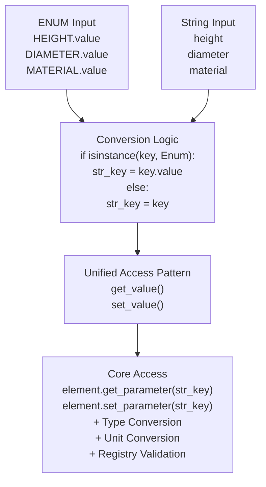

# HybridParameterInterface - Unified Access Patterns

> *"Schnittstellen von Verarbeitungslogik trennen"* - HybridParameterInterface als Bridge zwischen Zugriffsmuster

## 🎯 Purpose

Das `HybridParameterInterface` löst ein fundamentales Problem: **Wie ermöglicht man sowohl typsichere ENUM-basierte als auch flexible string-basierte Parameter-Zugriffe auf dieselben Daten?**

Die Antwort: Eine einzige Schnittstelle, die beide Patterns nahtlos vereint.

## 🏗️ Design Philosophy

### Unix-Prinzip: Interface-Abstraktion

```python
# Problem: Verschiedene Zugriffsmuster, gleiche Daten
height_enum = element.get_railway_parameter(RailwayParameters.HEIGHT)     # ENUM-based
height_string = element.get_parameter("height")                          # String-based

# Lösung: Einheitliches Interface
interface = HybridParameterInterface(element, registry)
height1 = interface.get_value(RailwayParameters.HEIGHT.value, 0.0)       # ENUM → String
height2 = interface.get_value("height", 0.0)                             # Direct String
assert height1 == height2  # Identisches Verhalten
```

### Separation of Concerns

- **GenericElement**: Speichert Parameter (keine Zugriffsmuster)
- **ParameterRegistry**: Verwaltet Schema (keine Implementierung)
- **HybridParameterInterface**: Bietet Zugriff (keine Datenhaltung)

## 📊 Architecture Overview



## 🔧 Core Implementation

### HybridParameterInterface Class

**Location**: `src/pymcore/hybrid_parameter_interface.py:85`

```python
from typing import Union, Any, Optional
from enum import Enum

class HybridParameterInterface:
    """Unified interface for ENUM and string parameter access."""

    def __init__(self, element: GenericElement, mapping_name: str, registry: ParameterRegistry):
        self._element = element
        self._registry = registry
        self._mapping_name = mapping_name

    def get_value(self, key: Union[str, Enum], default: Any = None) -> Any:
        """Get parameter value with unified access pattern."""
        # Convert ENUM to string if needed
        str_key = key.value if isinstance(key, Enum) else key

        # Get descriptor for type validation
        descriptor = self._registry.get_descriptor(str_key)

        # Get value from element
        value = self._element.get_parameter(str_key, default)

        # Apply type validation if descriptor exists
        if descriptor and value != default:
            if not isinstance(value, descriptor.data_type):
                # Attempt type conversion
                try:
                    value = self._convert_to_type(value, descriptor.data_type)
                except ValueError:
                    return default

        return value

    def set_value(self, key: Union[str, Enum], value: Any, unit: Unit = None) -> None:
        """Set parameter value with unified access pattern."""
        # Convert ENUM to string if needed
        str_key = key.value if isinstance(key, Enum) else key

        # Get descriptor for conversion info
        descriptor = self._registry.get_descriptor(str_key)

        if descriptor:
            # Apply type conversion
            converted_value = self._convert_to_type(value, descriptor.data_type)

            # Apply unit conversion if needed
            if unit and unit != descriptor.unit:
                converted_value = self._convert_units(converted_value, unit, descriptor.unit)

            # Store converted value
            self._element.set_parameter(str_key, converted_value)
        else:
            # Store without validation (flexible mode)
            self._element.set_parameter(str_key, value)
```

## 🔄 Key Access Patterns

### Pattern 1: ENUM-Based Access (Type-Safe)

```python
# ENUM definition for railway parameters
class RailwayParameters(Enum):
    HEIGHT = "height"
    DIAMETER = "diameter"
    MATERIAL = "material"
    FOUNDATION_DEPTH = "foundation_depth"

# Usage with ENUM
interface = HybridParameterInterface(element, "railway_params", registry)

# Setting values with ENUM keys
interface.set_value(RailwayParameters.HEIGHT, 6000.0)
interface.set_value(RailwayParameters.DIAMETER, 200.0, Unit.MILLIMETER)
interface.set_value(RailwayParameters.MATERIAL, "steel")

# Getting values with ENUM keys
height = interface.get_value(RailwayParameters.HEIGHT, 0.0)
diameter = interface.get_value(RailwayParameters.DIAMETER, 0.0)
material = interface.get_value(RailwayParameters.MATERIAL, "")

# Type safety through IDE support
# RailwayParameters.HEIGHT. <- IDE autocompletion
# RailwayParameters.INVALID  <- Compile-time error
```

### Pattern 2: String-Based Access (Flexible)

```python
# Same interface, string keys
interface = HybridParameterInterface(element, "railway_params", registry)

# Setting values with string keys
interface.set_value("height", 6000.0)
interface.set_value("diameter", 200.0, Unit.MILLIMETER)
interface.set_value("material", "steel")

# Getting values with string keys
height = interface.get_value("height", 0.0)
diameter = interface.get_value("diameter", 0.0)
material = interface.get_value("material", "")

# Flexibility for dynamic parameter names
param_name = "height"  # Could come from config, user input, etc.
value = interface.get_value(param_name, 0.0)
```

### Pattern 3: Mixed Access (Best of Both)

```python
# Mix ENUM and string access as needed
interface = HybridParameterInterface(element, "railway_params", registry)

# ENUM for known, type-safe parameters
interface.set_value(RailwayParameters.HEIGHT, 6000.0)
interface.set_value(RailwayParameters.MATERIAL, "steel")

# String for dynamic or external parameters
external_params = {"custom_property": "value", "temp_data": 42}
for key, value in external_params.items():
    interface.set_value(key, value)

# Both patterns work identically
enum_height = interface.get_value(RailwayParameters.HEIGHT)
string_height = interface.get_value("height")
assert enum_height == string_height
```

## 🔄 Type & Unit Conversion Integration

### Type Conversion Process

```python
def _convert_to_type(self, value: Any, target_type: type) -> Any:
    """Convert value to target type using helper functions."""
    if target_type == float:
        return as_float(value, 0.0)
    elif target_type == int:
        return as_int(value, 0)
    elif target_type == bool:
        return as_bool(value, False)
    elif target_type == str:
        return as_str(value, "")
    else:
        # Fallback: attempt direct conversion
        try:
            return target_type(value)
        except (ValueError, TypeError):
            raise ValueError(f"Cannot convert {value} to {target_type}")
```

### Unit Conversion Integration

```python
def _convert_units(self, value: float, from_unit: Unit, to_unit: Unit) -> float:
    """Convert value between units using UnitConverter."""
    if from_unit == to_unit:
        return value

    converter = UnitConverter()
    try:
        return converter.convert_value(value, from_unit, to_unit)
    except UnitConversionError:
        # Log warning but store original value
        print(f"Warning: Cannot convert {from_unit} to {to_unit}")
        return value
```

### Complete Conversion Example

```python
# Set value with type and unit conversion
interface.set_value("height", "5.0", Unit.METER)

# Conversion pipeline:
# 1. "5.0" (str) → 5.0 (float) via as_float()
# 2. 5.0 METER → 5000.0 MILLIMETER via UnitConverter
# 3. Store 5000.0 in element

# Retrieve converted value
height = interface.get_value("height")  # → 5000.0
```

## 🎯 Integration Patterns

### With Element Factory

```python
class ElementFactory:
    """Factory that creates elements with interface."""

    def create_pole_with_interface(self, element_id: str, registry: ParameterRegistry) -> Tuple[GenericElement, HybridParameterInterface]:
        # Create element
        element = GenericElement(element_id, "POLE")

        # Define parameters
        element.define_parameter("height", ValueType.FLOAT, Unit.MILLIMETER)
        element.define_parameter("diameter", ValueType.FLOAT, Unit.MILLIMETER)
        element.define_parameter("material", ValueType.STRING, Unit.NONE)

        # Create interface
        interface = HybridParameterInterface(element, "pole_params", registry)

        return element, interface

    def setup_pole_with_defaults(self, element_id: str, registry: ParameterRegistry) -> HybridParameterInterface:
        element, interface = self.create_pole_with_interface(element_id, registry)

        # Set default values through interface
        interface.set_value(RailwayParameters.HEIGHT, 6000.0)
        interface.set_value(RailwayParameters.DIAMETER, 200.0)
        interface.set_value(RailwayParameters.MATERIAL, "steel")

        return interface
```

### With Domain Classes

```python
class Pole:
    """Domain-specific pole class using HybridParameterInterface."""

    def __init__(self, element_id: str, registry: ParameterRegistry):
        self._element = GenericElement(element_id, "POLE")
        self._setup_parameters()
        self._interface = HybridParameterInterface(self._element, "pole_params", registry)

    def _setup_parameters(self):
        """Define pole-specific parameters."""
        self._element.define_parameter("height", ValueType.FLOAT, Unit.MILLIMETER)
        self._element.define_parameter("diameter", ValueType.FLOAT, Unit.MILLIMETER)
        self._element.define_parameter("material", ValueType.STRING, Unit.NONE)
        self._element.define_parameter("foundation_depth", ValueType.FLOAT, Unit.MILLIMETER)

    # Type-safe property access through interface
    @property
    def height(self) -> float:
        return self._interface.get_value(RailwayParameters.HEIGHT, 0.0)

    @height.setter
    def height(self, value: float):
        self._interface.set_value(RailwayParameters.HEIGHT, value)

    def set_height(self, value: float, unit: Unit = Unit.MILLIMETER):
        """Set height with unit conversion."""
        self._interface.set_value(RailwayParameters.HEIGHT, value, unit)

    @property
    def diameter(self) -> float:
        return self._interface.get_value(RailwayParameters.DIAMETER, 0.0)

    @diameter.setter
    def diameter(self, value: float):
        self._interface.set_value(RailwayParameters.DIAMETER, value)

    @property
    def material(self) -> str:
        return self._interface.get_value(RailwayParameters.MATERIAL, "")

    @material.setter
    def material(self, value: str):
        self._interface.set_value(RailwayParameters.MATERIAL, value)

    # Generic parameter access through interface
    def get_parameter(self, key: Union[str, RailwayParameters], default: Any = None) -> Any:
        """Generic parameter access."""
        return self._interface.get_value(key, default)

    def set_parameter(self, key: Union[str, RailwayParameters], value: Any, unit: Unit = None):
        """Generic parameter setting."""
        self._interface.set_value(key, value, unit)

    def get_core_element(self) -> GenericElement:
        """Get underlying GenericElement for repository operations."""
        return self._element
```

## 🔍 Validation & Error Handling

### Registry-Based Validation

```python
class ValidatingHybridInterface(HybridParameterInterface):
    """Interface with enhanced validation."""

    def set_value(self, key: Union[str, Enum], value: Any, unit: Unit = None) -> None:
        """Set value with comprehensive validation."""
        str_key = key.value if isinstance(key, Enum) else key
        descriptor = self._registry.get_descriptor(str_key)

        if descriptor:
            # Type validation
            if not self._is_compatible_type(value, descriptor.data_type):
                try:
                    value = self._convert_to_type(value, descriptor.data_type)
                except ValueError as e:
                    raise ParameterValidationError(f"Cannot convert {value} to {descriptor.data_type}: {e}")

            # Unit validation
            if unit and not self._is_compatible_unit(unit, descriptor.unit):
                raise ParameterValidationError(f"Unit {unit} is not compatible with expected {descriptor.unit}")

            # Custom validation (if defined in descriptor)
            if hasattr(descriptor, 'validation_rules'):
                for rule in descriptor.validation_rules:
                    if not rule(value):
                        raise ParameterValidationError(f"Value {value} violates validation rule")

        super().set_value(key, value, unit)

    def _is_compatible_type(self, value: Any, target_type: type) -> bool:
        """Check if value can be converted to target type."""
        if target_type == float:
            return is_float(value)
        elif target_type == int:
            return is_int(value)
        elif target_type == bool:
            return is_bool(value)
        elif target_type == str:
            return True  # Everything can be converted to string
        else:
            return isinstance(value, target_type)

    def _is_compatible_unit(self, source_unit: Unit, target_unit: Unit) -> bool:
        """Check if units are compatible for conversion."""
        converter = UnitConverter()
        return converter.are_compatible(source_unit, target_unit)
```

### Error Handling Patterns

```python
class RobustHybridInterface(HybridParameterInterface):
    """Interface with graceful error handling."""

    def get_value_safe(self, key: Union[str, Enum], default: Any = None) -> Tuple[Any, Optional[str]]:
        """Get value with error information."""
        try:
            value = self.get_value(key, default)
            return value, None
        except Exception as e:
            return default, str(e)

    def set_value_safe(self, key: Union[str, Enum], value: Any, unit: Unit = None) -> Tuple[bool, Optional[str]]:
        """Set value with success/error information."""
        try:
            self.set_value(key, value, unit)
            return True, None
        except Exception as e:
            return False, str(e)

    def batch_set_values(self, values: Dict[Union[str, Enum], Tuple[Any, Optional[Unit]]]) -> Dict[str, Optional[str]]:
        """Set multiple values with individual error handling."""
        results = {}

        for key, (value, unit) in values.items():
            str_key = key.value if isinstance(key, Enum) else key
            success, error = self.set_value_safe(key, value, unit)
            results[str_key] = error if not success else None

        return results
```

## 🧪 Testing Strategies

### Interface Testing

```python
def test_hybrid_access_patterns():
    """Test ENUM and string access patterns."""
    registry = ParameterRegistry()
    registry.register_parameter(ParameterDescriptor("height", float, Unit.MILLIMETER))

    element = GenericElement("test", "pole")
    element.define_parameter("height", ValueType.FLOAT, Unit.MILLIMETER)

    interface = HybridParameterInterface(element, "test_params", registry)

    # Test ENUM access
    interface.set_value(RailwayParameters.HEIGHT.value, 6000.0)
    height_enum = interface.get_value(RailwayParameters.HEIGHT.value)

    # Test string access
    height_string = interface.get_value("height")

    # Should be identical
    assert height_enum == height_string == 6000.0

def test_type_conversion():
    """Test automatic type conversion."""
    registry = ParameterRegistry()
    registry.register_parameter(ParameterDescriptor("height", float, Unit.MILLIMETER))

    element = GenericElement("test", "pole")
    element.define_parameter("height", ValueType.FLOAT, Unit.MILLIMETER)

    interface = HybridParameterInterface(element, "test_params", registry)

    # Test string to float conversion
    interface.set_value("height", "5000.0")
    assert interface.get_value("height") == 5000.0

    # Test int to float conversion
    interface.set_value("height", 6000)
    assert interface.get_value("height") == 6000.0

def test_unit_conversion():
    """Test automatic unit conversion."""
    registry = ParameterRegistry()
    registry.register_parameter(ParameterDescriptor("height", float, Unit.MILLIMETER))

    element = GenericElement("test", "pole")
    element.define_parameter("height", ValueType.FLOAT, Unit.MILLIMETER)

    interface = HybridParameterInterface(element, "test_params", registry)

    # Set in meters, should convert to millimeters
    interface.set_value("height", 5.0, Unit.METER)
    assert interface.get_value("height") == 5000.0

    # Set in centimeters, should convert to millimeters
    interface.set_value("height", 500.0, Unit.CENTIMETER)
    assert interface.get_value("height") == 5000.0
```

### Integration Testing

```python
def test_domain_class_integration():
    """Test interface with domain-specific classes."""
    registry = RailwayRegistrySetup.setup_railway_registry()
    pole = Pole("test_pole", registry)

    # Test property access
    pole.height = 6000.0
    assert pole.height == 6000.0

    # Test unit conversion
    pole.set_height(5.0, Unit.METER)
    assert pole.height == 5000.0

    # Test generic access
    pole.set_parameter(RailwayParameters.DIAMETER, 200.0)
    assert pole.get_parameter("diameter") == 200.0

    # Test mixed access
    pole.set_parameter("material", "steel")
    assert pole.material == "steel"
```

## ⚡ Performance Optimization

### Lazy Registry Lookup

```python
class OptimizedHybridInterface(HybridParameterInterface):
    """Interface with performance optimizations."""

    def __init__(self, element: GenericElement, mapping_name: str, registry: ParameterRegistry):
        super().__init__(element, mapping_name, registry)
        self._descriptor_cache = {}

    def _get_descriptor_cached(self, str_key: str) -> Optional[ParameterDescriptor]:
        """Get descriptor with caching."""
        if str_key not in self._descriptor_cache:
            self._descriptor_cache[str_key] = self._registry.get_descriptor(str_key)
        return self._descriptor_cache[str_key]

    def get_value(self, key: Union[str, Enum], default: Any = None) -> Any:
        """Optimized get with cached lookups."""
        str_key = key.value if isinstance(key, Enum) else key
        descriptor = self._get_descriptor_cached(str_key)

        # Fast path: no descriptor, direct access
        if not descriptor:
            return self._element.get_parameter(str_key, default)

        # Validated path: with type checking
        value = self._element.get_parameter(str_key, default)
        if value != default and not isinstance(value, descriptor.data_type):
            try:
                return self._convert_to_type(value, descriptor.data_type)
            except ValueError:
                return default

        return value
```

## 🚀 Future Extensions

### Multi-Domain Interface

```python
class MultiDomainHybridInterface:
    """Interface supporting multiple parameter domains."""

    def __init__(self, element: GenericElement, domain_registries: Dict[str, ParameterRegistry]):
        self._element = element
        self._domains = domain_registries
        self._current_domain = None

    def use_domain(self, domain_name: str) -> 'MultiDomainHybridInterface':
        """Switch to specific domain context."""
        if domain_name in self._domains:
            self._current_domain = domain_name
        return self

    def get_value(self, key: Union[str, Enum], default: Any = None, domain: str = None) -> Any:
        """Get value with domain-specific context."""
        domain = domain or self._current_domain
        if domain and domain in self._domains:
            registry = self._domains[domain]
            interface = HybridParameterInterface(self._element, f"{domain}_params", registry)
            return interface.get_value(key, default)

        # Fallback to direct element access
        str_key = key.value if isinstance(key, Enum) else key
        return self._element.get_parameter(str_key, default)

# Usage
multi_interface = MultiDomainHybridInterface(element, {
    "railway": railway_registry,
    "drainage": drainage_registry
})

# Domain-specific access
railway_height = multi_interface.use_domain("railway").get_value("height")
drainage_diameter = multi_interface.use_domain("drainage").get_value("diameter")
```

### Computed Parameters

```python
class ComputedParameterInterface(HybridParameterInterface):
    """Interface with support for computed parameters."""

    def __init__(self, element: GenericElement, mapping_name: str, registry: ParameterRegistry):
        super().__init__(element, mapping_name, registry)
        self._computed_params = {}

    def register_computed_parameter(self, key: str, computation: Callable[['ComputedParameterInterface'], Any]):
        """Register computed parameter."""
        self._computed_params[key] = computation

    def get_value(self, key: Union[str, Enum], default: Any = None) -> Any:
        """Get value including computed parameters."""
        str_key = key.value if isinstance(key, Enum) else key

        # Check if it's a computed parameter
        if str_key in self._computed_params:
            try:
                return self._computed_params[str_key](self)
            except Exception:
                return default

        # Regular parameter access
        return super().get_value(key, default)

# Usage
interface = ComputedParameterInterface(element, "pole_params", registry)

# Register computed volume
interface.register_computed_parameter("volume",
    lambda i: i.get_value("length") * i.get_value("width") * i.get_value("height"))

# Access computed parameter
volume = interface.get_value("volume")  # Automatically computed
```

## 📚 Related Documentation

- **[Parameter System](../core/parameter-system.md)** - Definition/value separation concepts
- **[Registry System](../core/registry-system.md)** - Semantic parameter mapping
- **[Type Conversion](./type-conversion.md)** - Helper functions and conversions
- **[Railway Elements](../application/railway-elements.md)** - Domain-specific usage patterns

---

**HybridParameterInterface verkörpert Unix-Weisheit: Eine einfache Schnittstelle verbindet komplexe Programme und macht sie interoperabel.** 🔄⚡
