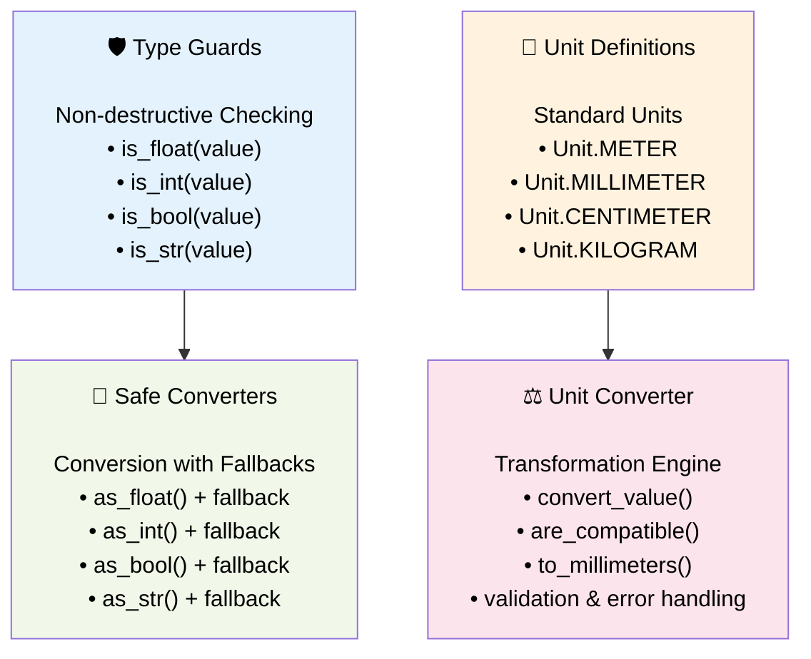

# Type & Unit Conversion - Safe Value Transformations

> *"Entwirf für die Zukunft"* - Robuste Konvertierung für unvorhersehbare Eingaben

## 🎯 Purpose

Das Type & Unit Conversion System von PyM Core löst ein fundamentales Problem: **Wie kann man sicher und vorhersagbar zwischen verschiedenen Datentypen und Einheiten konvertieren, ohne das System zum Absturz zu bringen?**

Die Antwort: Explizite Konvertierungsfunktionen mit Fallback-Werten und umfassende Unit-Conversion mit Kompatibilitätsprüfung.

## 🏗️ Design Philosophy

### Unix-Prinzip: Robustheit durch Einfachheit

```python
# Problem: Unvorhersehbare Eingaben
user_input = "5.5"      # String from UI
config_value = 42       # Int from config
sensor_data = 7.8       # Float from sensor

# Lösung: Sichere Konvertierung mit Fallbacks
height = as_float(user_input, 0.0)    # → 5.5
count = as_int(config_value, 1)       # → 42
temperature = as_float(sensor_data)   # → 7.8

# Kein Crash, immer valide Werte
```

### Two-Layer Approach

- **Type Guards**: Non-destructive checking (`is_float`, `is_int`)
- **Safe Converters**: Conversion with fallbacks (`as_float`, `as_int`)

## 📊 Architecture Overview



## 🔧 Type Conversion System

### Type Guards (Non-Destructive Checking)

**Location**: `src/pymcore/helper/values.py`

```python
def is_float(value: Any) -> bool:
    """Check if value can be converted to float without actually converting."""
    if isinstance(value, (int, float)):
        return True
    if isinstance(value, str):
        try:
            float(value)
            return True
        except ValueError:
            return False
    return False

def is_int(value: Any) -> bool:
    """Check if value can be converted to int."""
    if isinstance(value, int):
        return True
    if isinstance(value, float) and value.is_integer():
        return True
    if isinstance(value, str):
        try:
            int(value)
            return True
        except ValueError:
            # Try float first, then check if integer
            try:
                float_val = float(value)
                return float_val.is_integer()
            except ValueError:
                return False
    return False

def is_bool(value: Any) -> bool:
    """Check if value can be converted to bool."""
    if isinstance(value, bool):
        return True
    if isinstance(value, str) and value.lower() in ('true', 'false', '1', '0'):
        return True
    if isinstance(value, (int, float)) and value in (0, 1, 0.0, 1.0):
        return True
    return False

def is_str(value: Any) -> bool:
    """Check if value can be converted to string (always True except None)."""
    return value is not None
```

### Safe Converters (With Fallbacks)

```python
def as_float(value: Any, fallback: float = 0.0) -> float:
    """Convert value to float with fallback on failure."""
    if isinstance(value, (int, float)):
        return float(value)
    if isinstance(value, str):
        try:
            return float(value)
        except ValueError:
            return fallback
    if isinstance(value, bool):
        return 1.0 if value else 0.0
    return fallback

def as_int(value: Any, fallback: int = 0) -> int:
    """Convert value to int with fallback on failure."""
    if isinstance(value, int):
        return value
    if isinstance(value, float):
        if value.is_integer():
            return int(value)
        else:
            return fallback  # Don't truncate non-integers
    if isinstance(value, str):
        try:
            # Try direct int conversion first
            return int(value)
        except ValueError:
            try:
                # Try float conversion then check if integer
                float_val = float(value)
                if float_val.is_integer():
                    return int(float_val)
                else:
                    return fallback
            except ValueError:
                return fallback
    if isinstance(value, bool):
        return 1 if value else 0
    return fallback

def as_bool(value: Any, fallback: bool = False) -> bool:
    """Convert value to bool with fallback on failure."""
    if isinstance(value, bool):
        return value
    if isinstance(value, str):
        lower_val = value.lower()
        if lower_val in ('true', '1', 'yes', 'on'):
            return True
        elif lower_val in ('false', '0', 'no', 'off'):
            return False
        else:
            return fallback
    if isinstance(value, (int, float)):
        if value == 1 or value == 1.0:
            return True
        elif value == 0 or value == 0.0:
            return False
        else:
            return fallback
    return fallback

def as_str(value: Any, fallback: str = "") -> str:
    """Convert value to string with fallback."""
    if value is None:
        return fallback
    if isinstance(value, str):
        return value
    try:
        return str(value)
    except Exception:
        return fallback
```

### Conversion Matrix

| Input Value | `as_int()` | `as_float()` | `as_bool()` | `as_str()` |
|-------------|------------|--------------|-------------|------------|
| `42` | `42` | `42.0` | `False` | `"42"` |
| `42.0` | `42` | `42.0` | `False` | `"42.0"` |
| `1` | `1` | `1.0` | `True` | `"1"` |
| `1.0` | `1` | `1.0` | `True` | `"1.0"` |
| `"42"` | `42` | `42.0` | `False` | `"42"` |
| `"42.5"` | `fallback` | `42.5` | `False` | `"42.5"` |
| `"true"` | `fallback` | `fallback` | `True` | `"true"` |
| `"false"` | `fallback` | `fallback` | `False` | `"false"` |
| `True` | `1` | `1.0` | `True` | `"True"` |
| `False` | `0` | `0.0` | `False` | `"False"` |
| `None` | `fallback` | `fallback` | `fallback` | `fallback` |
| `"invalid"` | `fallback` | `fallback` | `fallback` | `"invalid"` |

## 🔧 Unit Conversion System

### Unit Definitions

**Location**: `src/pymcore/types.py`

```python
from enum import Enum

class Unit(Enum):
    """Unit enumeration for parameter values."""

    # Length units
    MILLIMETER = "mm"
    CENTIMETER = "cm"
    METER = "m"
    KILOMETER = "km"

    # Area units
    SQUARE_MILLIMETER = "mm²"
    SQUARE_METER = "m²"

    # Volume units
    CUBIC_MILLIMETER = "mm³"
    CUBIC_METER = "m³"

    # Mass units
    GRAM = "g"
    KILOGRAM = "kg"
    TON = "t"

    # Dimensionless
    NONE = ""
    PERCENT = "%"

    # Electrical
    VOLT = "V"
    AMPERE = "A"
    WATT = "W"
```

### UnitConverter Implementation

**Location**: `src/pymcore/unit_converter.py:25`

```python
class UnitConverter:
    """Handles unit conversions with validation and error handling."""

    def __init__(self):
        # Define conversion factors (to millimeters for length)
        self.conversion_factors = {
            # Length conversions
            (Unit.METER, Unit.MILLIMETER): 1000.0,
            (Unit.CENTIMETER, Unit.MILLIMETER): 10.0,
            (Unit.KILOMETER, Unit.MILLIMETER): 1_000_000.0,
            (Unit.MILLIMETER, Unit.MILLIMETER): 1.0,

            # Reverse length conversions
            (Unit.MILLIMETER, Unit.METER): 0.001,
            (Unit.MILLIMETER, Unit.CENTIMETER): 0.1,
            (Unit.MILLIMETER, Unit.KILOMETER): 0.000_001,

            # Area conversions
            (Unit.SQUARE_METER, Unit.SQUARE_MILLIMETER): 1_000_000.0,
            (Unit.SQUARE_MILLIMETER, Unit.SQUARE_METER): 0.000_001,

            # Mass conversions
            (Unit.KILOGRAM, Unit.GRAM): 1000.0,
            (Unit.TON, Unit.KILOGRAM): 1000.0,
            (Unit.GRAM, Unit.KILOGRAM): 0.001,
            (Unit.KILOGRAM, Unit.TON): 0.001,
        }

        # Define unit families for compatibility checking
        self.unit_families = {
            'length': {Unit.MILLIMETER, Unit.CENTIMETER, Unit.METER, Unit.KILOMETER},
            'area': {Unit.SQUARE_MILLIMETER, Unit.SQUARE_METER},
            'volume': {Unit.CUBIC_MILLIMETER, Unit.CUBIC_METER},
            'mass': {Unit.GRAM, Unit.KILOGRAM, Unit.TON},
            'electrical': {Unit.VOLT, Unit.AMPERE, Unit.WATT},
            'dimensionless': {Unit.NONE, Unit.PERCENT}
        }

    def convert_value(self, value: float, from_unit: Unit, to_unit: Unit) -> float:
        """Convert value between compatible units."""
        if from_unit == to_unit:
            return value

        # Look up conversion factor
        factor = self.conversion_factors.get((from_unit, to_unit))
        if factor is None:
            raise UnitConversionError(f"Cannot convert {from_unit.value} to {to_unit.value}")

        return value * factor

    def are_compatible(self, unit1: Unit, unit2: Unit) -> bool:
        """Check if two units belong to the same family and can be converted."""
        if unit1 == unit2:
            return True

        # Check if both units are in the same family
        for family_units in self.unit_families.values():
            if unit1 in family_units and unit2 in family_units:
                return True

        return False

    def get_unit_family(self, unit: Unit) -> Optional[str]:
        """Get the family name for a unit."""
        for family_name, family_units in self.unit_families.items():
            if unit in family_units:
                return family_name
        return None

    def to_millimeters(self, value: float, from_unit: Unit) -> float:
        """Convert any length unit to millimeters (standard internal unit)."""
        if self.get_unit_family(from_unit) != 'length':
            raise UnitConversionError(f"Cannot convert {from_unit.value} to millimeters (not a length unit)")

        return self.convert_value(value, from_unit, Unit.MILLIMETER)

    def from_millimeters(self, value_mm: float, to_unit: Unit) -> float:
        """Convert millimeters to any length unit."""
        if self.get_unit_family(to_unit) != 'length':
            raise UnitConversionError(f"Cannot convert millimeters to {to_unit.value} (not a length unit)")

        return self.convert_value(value_mm, Unit.MILLIMETER, to_unit)
```

### Unit Conversion Examples

```python
converter = UnitConverter()

# Length conversions
assert converter.convert_value(5.0, Unit.METER, Unit.MILLIMETER) == 5000.0
assert converter.convert_value(500.0, Unit.CENTIMETER, Unit.MILLIMETER) == 5000.0
assert converter.convert_value(5000.0, Unit.MILLIMETER, Unit.METER) == 5.0

# Area conversions
assert converter.convert_value(1.0, Unit.SQUARE_METER, Unit.SQUARE_MILLIMETER) == 1_000_000.0

# Mass conversions
assert converter.convert_value(1.0, Unit.KILOGRAM, Unit.GRAM) == 1000.0
assert converter.convert_value(1.0, Unit.TON, Unit.KILOGRAM) == 1000.0

# Compatibility checking
assert converter.are_compatible(Unit.METER, Unit.MILLIMETER) == True
assert converter.are_compatible(Unit.METER, Unit.KILOGRAM) == False

# Helper methods
assert converter.to_millimeters(5.0, Unit.METER) == 5000.0
assert converter.from_millimeters(5000.0, Unit.METER) == 5.0
```

## 🔄 Integration Patterns

### With HybridParameterInterface

```python
class HybridParameterInterface:
    def set_value(self, key: Union[str, Enum], value: Any, unit: Unit = None) -> None:
        """Set value with type and unit conversion."""
        str_key = key.value if isinstance(key, Enum) else key
        descriptor = self._registry.get_descriptor(str_key)

        if descriptor:
            # Step 1: Type conversion
            converted_value = self._convert_to_type(value, descriptor.data_type)

            # Step 2: Unit conversion (if needed)
            if unit and unit != descriptor.unit:
                converted_value = self._convert_units(converted_value, unit, descriptor.unit)

            # Store converted value
            self._element.set_parameter(str_key, converted_value)

    def _convert_to_type(self, value: Any, target_type: type) -> Any:
        """Convert value to target type using helper functions."""
        if target_type == float:
            return as_float(value, 0.0)
        elif target_type == int:
            return as_int(value, 0)
        elif target_type == bool:
            return as_bool(value, False)
        elif target_type == str:
            return as_str(value, "")
        else:
            # Attempt direct conversion as fallback
            try:
                return target_type(value)
            except (ValueError, TypeError):
                raise ValueError(f"Cannot convert {value} to {target_type}")

    def _convert_units(self, value: float, from_unit: Unit, to_unit: Unit) -> float:
        """Convert value between units using UnitConverter."""
        converter = UnitConverter()
        try:
            return converter.convert_value(value, from_unit, to_unit)
        except UnitConversionError as e:
            # Log warning but store original value
            print(f"Warning: {e}")
            return value
```

### Complete Conversion Pipeline Example

```python
# Input: Mixed types and units
raw_inputs = {
    "height": ("5.5", Unit.METER),        # String meters
    "diameter": (200, Unit.MILLIMETER),   # Int millimeters
    "active": ("true", None),             # String bool
    "count": (42.0, None)                 # Float int
}

# Process through conversion pipeline
interface = HybridParameterInterface(element, registry)

for key, (value, unit) in raw_inputs.items():
    interface.set_value(key, value, unit)

# Results: All properly converted and stored
assert interface.get_value("height") == 5500.0      # Converted to mm
assert interface.get_value("diameter") == 200.0     # Already correct
assert interface.get_value("active") == True        # String → bool
assert interface.get_value("count") == 42           # Float → int
```

### With Domain Classes

```python
class Pole:
    """Domain class with automatic type/unit conversion."""

    def set_height(self, value: Any, unit: Unit = Unit.MILLIMETER):
        """Set height with automatic conversion."""
        # Type conversion
        height_float = as_float(value, 0.0)

        # Unit conversion to internal millimeters
        if unit != Unit.MILLIMETER:
            converter = UnitConverter()
            if converter.are_compatible(unit, Unit.MILLIMETER):
                height_float = converter.to_millimeters(height_float, unit)
            else:
                raise ValueError(f"Cannot convert {unit} to millimeters")

        self._interface.set_value("height", height_float)

    def set_material(self, value: Any):
        """Set material with string conversion."""
        material_str = as_str(value, "unknown")
        self._interface.set_value("material", material_str)

    def set_active(self, value: Any):
        """Set active status with bool conversion."""
        active_bool = as_bool(value, False)
        self._interface.set_value("active", active_bool)

# Usage with various input types
pole = Pole("pole_001", registry)

# All these work seamlessly
pole.set_height(6.5, Unit.METER)        # Float meters → 6500.0 mm
pole.set_height("5000", Unit.MILLIMETER) # String mm → 5000.0 mm
pole.set_material(123)                   # Int → "123"
pole.set_active("true")                  # String → True
```

## 🧪 Error Handling Strategies

### Graceful Degradation

```python
class RobustConverter:
    """Converter with graceful error handling."""

    def __init__(self):
        self.conversion_errors = []
        self.unit_converter = UnitConverter()

    def convert_safely(self, value: Any, target_type: type, unit: Unit = None,
                      target_unit: Unit = None) -> Tuple[Any, bool, Optional[str]]:
        """Convert with error tracking."""
        try:
            # Type conversion
            if target_type == float:
                converted = as_float(value)
            elif target_type == int:
                converted = as_int(value)
            elif target_type == bool:
                converted = as_bool(value)
            elif target_type == str:
                converted = as_str(value)
            else:
                converted = target_type(value)

            # Unit conversion
            if unit and target_unit and unit != target_unit:
                if isinstance(converted, (int, float)):
                    converted = self.unit_converter.convert_value(float(converted), unit, target_unit)
                else:
                    return converted, False, f"Cannot apply unit conversion to {type(converted)}"

            return converted, True, None

        except Exception as e:
            error_msg = f"Conversion failed: {value} → {target_type}: {e}"
            self.conversion_errors.append(error_msg)
            return self._get_fallback(target_type), False, error_msg

    def _get_fallback(self, target_type: type) -> Any:
        """Get sensible fallback value for type."""
        fallbacks = {
            float: 0.0,
            int: 0,
            bool: False,
            str: ""
        }
        return fallbacks.get(target_type, None)
```

### Validation Before Conversion

```python
class ValidatingConverter:
    """Converter with pre-conversion validation."""

    def validate_before_convert(self, value: Any, target_type: type,
                              unit: Unit = None, target_unit: Unit = None) -> List[str]:
        """Validate conversion possibility before attempting."""
        errors = []

        # Type validation
        if target_type == float and not is_float(value):
            errors.append(f"Cannot convert {value} to float")
        elif target_type == int and not is_int(value):
            errors.append(f"Cannot convert {value} to int")
        elif target_type == bool and not is_bool(value):
            errors.append(f"Cannot convert {value} to bool")

        # Unit validation
        if unit and target_unit:
            converter = UnitConverter()
            if not converter.are_compatible(unit, target_unit):
                errors.append(f"Units {unit} and {target_unit} are not compatible")

        return errors

    def convert_with_validation(self, value: Any, target_type: type,
                               unit: Unit = None, target_unit: Unit = None) -> Any:
        """Convert only after validation passes."""
        errors = self.validate_before_convert(value, target_type, unit, target_unit)

        if errors:
            raise ValueError(f"Validation failed: {'; '.join(errors)}")

        # Proceed with conversion
        robust_converter = RobustConverter()
        result, success, error = robust_converter.convert_safely(value, target_type, unit, target_unit)

        if not success:
            raise ValueError(error)

        return result
```

## 🧪 Testing Strategies

### Type Conversion Testing

```python
def test_type_guards():
    """Test type checking functions."""
    # Float checking
    assert is_float(5.5) == True
    assert is_float(5) == True
    assert is_float("5.5") == True
    assert is_float("invalid") == False

    # Int checking
    assert is_int(5) == True
    assert is_int(5.0) == True
    assert is_int("5") == True
    assert is_int(5.5) == False

    # Bool checking
    assert is_bool(True) == True
    assert is_bool("true") == True
    assert is_bool(1) == True
    assert is_bool(2) == False

def test_safe_converters():
    """Test conversion functions with fallbacks."""
    # Float conversion
    assert as_float("5.5") == 5.5
    assert as_float("invalid", 99.0) == 99.0
    assert as_float(True) == 1.0

    # Int conversion
    assert as_int("5") == 5
    assert as_int(5.0) == 5
    assert as_int(5.5, 99) == 99  # Non-integer float

    # Bool conversion
    assert as_bool("true") == True
    assert as_bool("false") == False
    assert as_bool(1) == True
    assert as_bool("invalid", True) == True

def test_conversion_edge_cases():
    """Test edge cases and error conditions."""
    # None handling
    assert as_float(None, 42.0) == 42.0
    assert as_int(None, 42) == 42
    assert as_bool(None, True) == True
    assert as_str(None, "default") == "default"

    # Empty string handling
    assert as_float("", 42.0) == 42.0
    assert as_int("", 42) == 42
    assert as_str("") == ""
```

### Unit Conversion Testing

```python
def test_unit_conversions():
    """Test unit conversion functionality."""
    converter = UnitConverter()

    # Basic length conversions
    assert converter.convert_value(1.0, Unit.METER, Unit.MILLIMETER) == 1000.0
    assert converter.convert_value(100.0, Unit.CENTIMETER, Unit.METER) == 1.0
    assert converter.convert_value(1000.0, Unit.MILLIMETER, Unit.METER) == 1.0

    # Same unit (no conversion)
    assert converter.convert_value(5.0, Unit.METER, Unit.METER) == 5.0

    # Area conversions
    assert converter.convert_value(1.0, Unit.SQUARE_METER, Unit.SQUARE_MILLIMETER) == 1_000_000.0

    # Mass conversions
    assert converter.convert_value(1.0, Unit.KILOGRAM, Unit.GRAM) == 1000.0

def test_unit_compatibility():
    """Test unit compatibility checking."""
    converter = UnitConverter()

    # Compatible units
    assert converter.are_compatible(Unit.METER, Unit.MILLIMETER) == True
    assert converter.are_compatible(Unit.KILOGRAM, Unit.GRAM) == True

    # Incompatible units
    assert converter.are_compatible(Unit.METER, Unit.KILOGRAM) == False
    assert converter.are_compatible(Unit.SQUARE_METER, Unit.METER) == False

def test_unit_conversion_errors():
    """Test unit conversion error handling."""
    converter = UnitConverter()

    # Incompatible conversion should raise error
    with pytest.raises(UnitConversionError):
        converter.convert_value(5.0, Unit.METER, Unit.KILOGRAM)

    # Non-existent conversion should raise error
    with pytest.raises(UnitConversionError):
        converter.convert_value(5.0, Unit.VOLT, Unit.AMPERE)
```

### Integration Testing

```python
def test_conversion_integration():
    """Test type and unit conversion working together."""
    registry = ParameterRegistry()
    registry.register_parameter(ParameterDescriptor(
        semantic_key="height",
        data_type=float,
        unit=Unit.MILLIMETER
    ))

    element = GenericElement("test", "pole")
    element.define_parameter("height", ValueType.FLOAT, Unit.MILLIMETER)

    interface = HybridParameterInterface(element, "test", registry)

    # Test string input with unit conversion
    interface.set_value("height", "5.5", Unit.METER)
    assert interface.get_value("height") == 5500.0

    # Test int input with unit conversion
    interface.set_value("height", 200, Unit.CENTIMETER)
    assert interface.get_value("height") == 2000.0

    # Test bool parameter
    registry.register_parameter(ParameterDescriptor("active", bool, Unit.NONE))
    element.define_parameter("active", ValueType.BOOL, Unit.NONE)

    interface.set_value("active", "true")
    assert interface.get_value("active") == True
```

## ⚡ Performance Optimization

### Conversion Caching

```python
class CachedConverter:
    """Converter with result caching for repeated conversions."""

    def __init__(self):
        self._type_cache = {}
        self._unit_cache = {}
        self.unit_converter = UnitConverter()

    def cached_type_convert(self, value: Any, target_type: type) -> Any:
        """Type conversion with caching."""
        cache_key = (str(value), target_type)

        if cache_key not in self._type_cache:
            if target_type == float:
                result = as_float(value)
            elif target_type == int:
                result = as_int(value)
            elif target_type == bool:
                result = as_bool(value)
            elif target_type == str:
                result = as_str(value)
            else:
                result = target_type(value)

            self._type_cache[cache_key] = result

        return self._type_cache[cache_key]

    def cached_unit_convert(self, value: float, from_unit: Unit, to_unit: Unit) -> float:
        """Unit conversion with caching."""
        cache_key = (value, from_unit, to_unit)

        if cache_key not in self._unit_cache:
            result = self.unit_converter.convert_value(value, from_unit, to_unit)
            self._unit_cache[cache_key] = result

        return self._unit_cache[cache_key]
```

### Fast Path Optimization

```python
class OptimizedConverter:
    """Converter optimized for common cases."""

    def fast_convert(self, value: Any, target_type: type) -> Any:
        """Optimized conversion for common cases."""

        # Fast path: already correct type
        if isinstance(value, target_type):
            return value

        # Fast path: common numeric conversions
        if target_type == float:
            if isinstance(value, int):
                return float(value)
            elif isinstance(value, str) and value.isdigit():
                return float(value)

        elif target_type == int:
            if isinstance(value, float) and value.is_integer():
                return int(value)
            elif isinstance(value, str) and value.isdigit():
                return int(value)

        # Fall back to safe conversion
        return self._safe_convert(value, target_type)
```

## 🚀 Future Extensions

### Advanced Unit Systems

```python
class AdvancedUnitConverter(UnitConverter):
    """Extended converter with more unit systems."""

    def __init__(self):
        super().__init__()

        # Add more unit families
        self.unit_families.update({
            'pressure': {Unit.PASCAL, Unit.BAR, Unit.PSI},
            'temperature': {Unit.CELSIUS, Unit.FAHRENHEIT, Unit.KELVIN},
            'time': {Unit.SECOND, Unit.MINUTE, Unit.HOUR, Unit.DAY}
        })

        # Add more conversion factors
        self.conversion_factors.update({
            # Pressure conversions
            (Unit.BAR, Unit.PASCAL): 100_000.0,
            (Unit.PSI, Unit.PASCAL): 6_894.76,

            # Temperature conversions (requires offset)
            # Note: Temperature conversions need special handling
        })

    def convert_temperature(self, value: float, from_unit: Unit, to_unit: Unit) -> float:
        """Special handling for temperature conversions with offsets."""
        if from_unit == to_unit:
            return value

        # Convert to Celsius first, then to target
        if from_unit == Unit.FAHRENHEIT:
            celsius = (value - 32) * 5/9
        elif from_unit == Unit.KELVIN:
            celsius = value - 273.15
        else:
            celsius = value

        # Convert from Celsius to target
        if to_unit == Unit.FAHRENHEIT:
            return celsius * 9/5 + 32
        elif to_unit == Unit.KELVIN:
            return celsius + 273.15
        else:
            return celsius
```

### Custom Conversion Rules

```python
class CustomConverter:
    """Converter with user-defined conversion rules."""

    def __init__(self):
        self.custom_converters = {}
        self.custom_validators = {}

    def register_custom_converter(self, from_type: type, to_type: type,
                                 converter_func: Callable[[Any], Any]):
        """Register custom conversion function."""
        self.custom_converters[(from_type, to_type)] = converter_func

    def register_custom_validator(self, target_type: type,
                                 validator_func: Callable[[Any], bool]):
        """Register custom validation function."""
        self.custom_validators[target_type] = validator_func

    def convert_with_custom_rules(self, value: Any, target_type: type) -> Any:
        """Convert using custom rules if available."""
        source_type = type(value)

        # Try custom converter first
        if (source_type, target_type) in self.custom_converters:
            return self.custom_converters[(source_type, target_type)](value)

        # Try custom validation
        if target_type in self.custom_validators:
            if not self.custom_validators[target_type](value):
                raise ValueError(f"Custom validation failed for {value} → {target_type}")

        # Fall back to standard conversion
        return self._standard_convert(value, target_type)

# Usage
converter = CustomConverter()

# Register custom BIM-specific conversions
converter.register_custom_converter(str, Unit, lambda s: Unit(s))
converter.register_custom_validator(float, lambda v: isinstance(v, (int, float, str)))
```

## 📚 Related Documentation

- **[Parameter System](../core/parameter-system.md)** - How conversions fit into parameter handling
- **[HybridParameterInterface](./hybrid-parameter.md)** - Interface using type/unit conversion
- **[Unix Principles](../philosophy/unix-principles.md)** - Robustness and error handling philosophy
- **[Helper Functions](../../src/pymcore/helper/)** - Implementation details

---

**Type & Unit Conversion verkörpert Unix-Robustheit: Programme sollten niemals wegen unerwarteter Eingaben versagen, sondern graceful degradation zeigen.** 🔧⚙️
